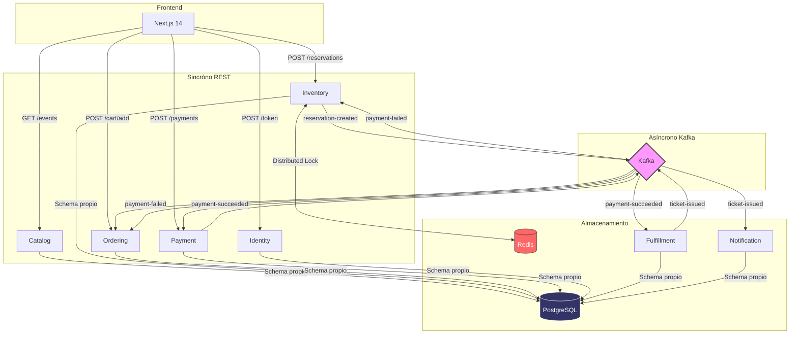

# SpecKit Ticketing Platform

[](https://en.wikipedia.org/wiki/Hexagonal_architecture_(software))
[]()
[]()
[]()

---

## El problema que resuelve

Imagina que se pone a la venta el concierto más esperado del año. En los primeros segundos, miles de usuarios intentan reservar el mismo asiento.

Sin una arquitectura adecuada, dos personas podrían comprar el mismo lugar. La confirmación de pago podría perderse en el camino. Un email nunca llegaría. El sistema colapsa bajo la carga o, peor, entrega boletos duplicados.

**SpecKit Ticketing** es una plataforma distribuida que resuelve exactamente eso: permite vender boletos para eventos en vivo de forma confiable, garantizando que cada asiento se venda una sola vez, que el flujo de compra se complete aunque falle alguna parte del sistema, y que el cliente reciba su boleto digital al instante.

---

## ¿Cómo funciona para el usuario?

El recorrido de compra es simple desde afuera:

```
1. El usuario explora eventos disponibles
2. Selecciona un asiento en el mapa interactivo
3. El asiento queda reservado por 15 minutos (solo para él)
4. Completa el checkout y pago
5. Recibe su boleto digital con QR por email
```

Lo que ocurre detrás de ese flujo es lo que hace al sistema interesante.

---

## Lo que ocurre detrás del flujo

Cada paso del recorrido es manejado por un servicio independiente:

```
Usuario selecciona asiento
        │
        ▼
[Inventory] — Adquiere un lock distribuido en Redis
               Reserva el asiento (TTL: 15 min)
               Publica → reservation-created
        │
        ▼ (Kafka)
[Ordering]  — Recibe la reserva en su caché local
               Usuario agrega al carrito → hace checkout
               Orden pasa de Draft a Pending
        │
        ▼ (HTTP)
[Payment]   — Valida la orden y la reserva (sin llamadas HTTP)
               Simula el procesamiento del pago
               Publica → payment-succeeded o payment-failed
        │
   ┌────┴──────────┐
   ▼               ▼
[Kafka]         [Kafka]
succeeded       failed
   │               │
   ▼               ▼
[Fulfillment]  [Ordering + Inventory]
Genera PDF      Cancela orden
Crea QR code    Libera el asiento
Publica →
ticket-issued
   │
   ▼ (Kafka)
[Notification]
Envía email con PDF adjunto
```

Si el pago falla, el asiento queda libre automáticamente. Si la reserva expira, el sistema verifica si hay usuarios en lista de espera antes de liberar el lugar. Cada servicio maneja su propia falla sin derribar a los demás.

---

## Decisiones de diseño que importan

### Concurrencia: locks distribuidos con Redis

Cuando dos usuarios intentan reservar el mismo asiento al mismo tiempo, Inventory adquiere un lock atómico en Redis antes de escribir en la base de datos. Solo uno lo obtiene. El otro recibe un 409 inmediatamente. Sin locks, en alta concurrencia, ambos podrían pasar la verificación de disponibilidad y reservar el mismo asiento.

### Consistencia eventual: caché Kafka en Ordering y Payment

Ordering y Payment no llaman HTTP a Inventory para validar reservas. En cambio, consumen el evento `reservation-created` y mantienen un caché local. Esto los hace independientes de la disponibilidad de Inventory y elimina latencia de red en cada operación de carrito.

### Coreografía, no orquestación

No hay un coordinador central que dirija el flujo de compra. Cada servicio reacciona a los eventos que le corresponden. Si Notification falla, el boleto sigue existiendo en Fulfillment. Si Payment tarda, el asiento sigue reservado. Los servicios son autónomos.

### Un solo PostgreSQL, schemas separados

El sistema usa una instancia PostgreSQL con un schema por servicio (`bc_catalog`, `bc_inventory`, `bc_ordering`, etc.). Esto simplifica el DevOps sin sacrificar el aislamiento — ningún servicio accede al schema de otro.

---

## Servicios del sistema

| Servicio | Puerto | Responsabilidad |
|----------|--------|-----------------|
| **Catalog** | 50001 | Eventos, detalles, mapas de asientos |
| **Inventory** | 50002 | Reservas con TTL, locks distribuidos |
| **Ordering** | 5003 | Carrito y ciclo de vida de órdenes |
| **Payment** | 5004 | Procesamiento y simulación de pagos |
| **Fulfillment** | 50004 | Generación de boletos PDF con QR |
| **Notification** | 50005 | Envío de emails con boletos |
| **Identity** | 50000 | Autenticación JWT, gestión de usuarios |
| **Waitlist** | 5006 | Lista de espera para eventos agotados |

---

## Stack tecnológico

| Capa | Tecnología |
|------|-----------|
| **Backend** | .NET 9, MediatR, EF Core, Minimal APIs |
| **Frontend** | Next.js 14 (App Router), TailwindCSS, Shadcn/UI |
| **Mensajería** | Apache Kafka (6 topics) |
| **Cache / Locks** | Redis 7 |
| **Base de datos** | PostgreSQL 17 (8 schemas) |
| **Contenedores** | Docker Compose (12 contenedores) |

---

## Inicio rápido

### Backend (microservicios + infraestructura)

```bash
cd infra
docker compose up -d
```

Esto levanta PostgreSQL, Redis, Kafka y los 8 microservicios. Las migraciones de base de datos se aplican automáticamente al iniciar cada servicio.

### Frontend

```bash
cd frontend
npm install
npm run dev
```

Acceder en `http://localhost:3000`

> No se requieren archivos `.env`. Todas las configuraciones están incluidas en `docker-compose.yml` y `appsettings.json` para facilitar el levantamiento sin configuración adicional.

---

## Verificación post-inicio

```bash
# Estado de todos los contenedores
docker compose ps

# Schemas creados en PostgreSQL
docker exec -it speckit-postgres psql -U postgres -d ticketing -c "\dn"

# Topics de Kafka disponibles
docker exec -it speckit-kafka kafka-topics --bootstrap-server localhost:9092 --list

# Health checks de servicios
curl http://localhost:50001/health   # Catalog
curl http://localhost:50002/health   # Inventory
curl http://localhost:5003/health    # Ordering
```

---

## Documentación técnica

La documentación detallada de cada componente está en [`docs/general/`](docs/general/):

| Documento | Contenido |
|-----------|-----------|
| [Arquitectura General](docs/general/00-arquitectura-general.md) | Patrones, ADRs, flujos de comunicación |
| [Identity Service](docs/general/01-identity-service.md) | JWT, autenticación, roles |
| [Catalog Service](docs/general/02-catalog-service.md) | Eventos, seatmap, administración |
| [Inventory Service](docs/general/03-inventory-service.md) | Reservas, locks Redis, TTL worker |
| [Ordering Service](docs/general/04-ordering-service.md) | Carrito, máquina de estados de órdenes |
| [Payment Service](docs/general/05-payment-service.md) | Procesamiento, simulación, eventos de resultado |
| [Fulfillment Service](docs/general/06-fulfillment-service.md) | Generación de PDF y QR codes |
| [Notification Service](docs/general/07-notification-service.md) | Emails, SMTP, dev mode |
| [Frontend](docs/general/08-frontend.md) | Next.js, páginas, clientes de API |
| [Infraestructura](docs/general/09-infraestructura.md) | Docker Compose, volúmenes, troubleshooting |
| [Contratos de Eventos](docs/general/10-contratos-de-eventos.md) | Schemas JSON de todos los eventos Kafka |
| [Feature: Waitlist](docs/general/11-waitlist-feature.md) | Lista de espera inteligente — negocio, HU, Gherkin, QA y DEV |

---

## Arquitectura en diagrama


