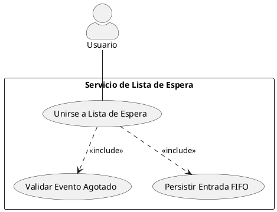
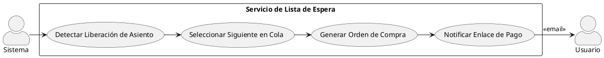
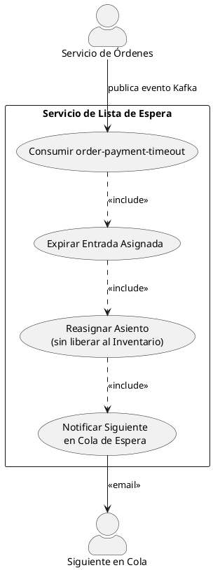
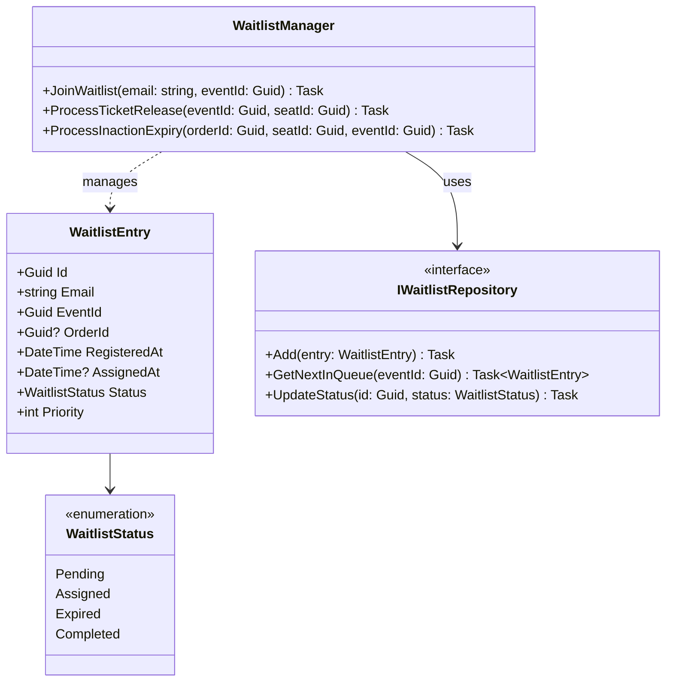
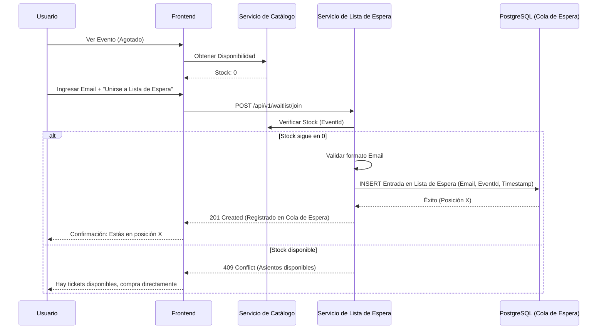
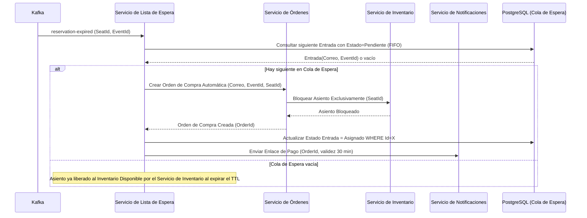
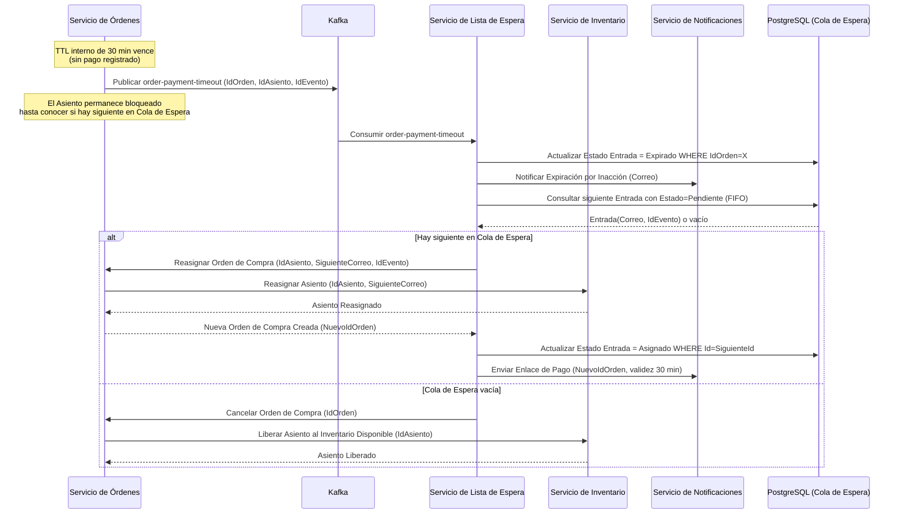
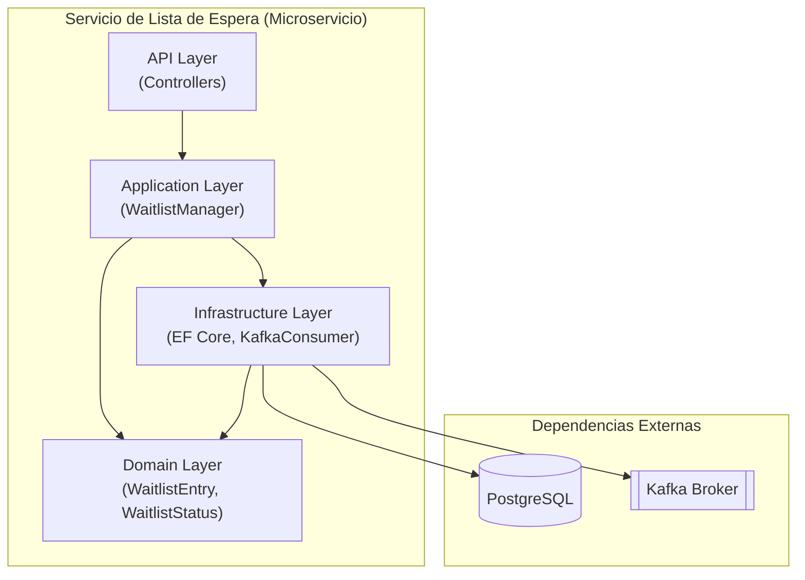
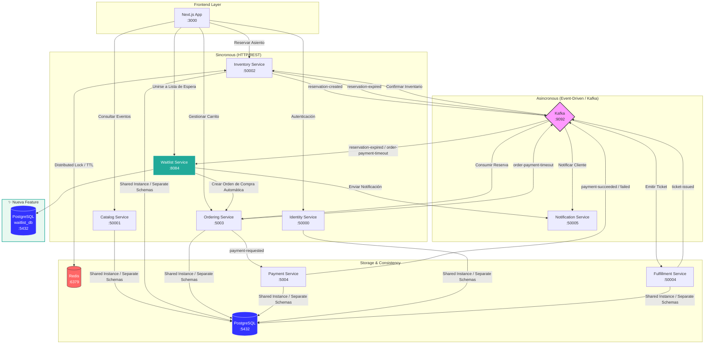

# Diseño de Feature - Vuelo Manual (Semana 6): Sistema de Lista de Espera Inteligente

**Autor:** Jostin Enrique Alvarado Sarmiento
**Fecha de inicio:** 25/03/2026
**Proyecto:** Sistema de ticketing

---

## 1. Contexto del Problema

### 1.1 Situación actual
*   **Qué hace hoy el sistema:** El sistema gestiona compras de tickets mediante un flujo lineal. Se inicia una Orden de Compra (`Ordering`), se reserva un Asiento con un TTL de 15 minutos (`Inventory`) y se procesa el pago. Si el evento está **Agotado**, el sistema rechaza cualquier intento nuevo.
*   **Limitaciones actuales:** Cuando una Reserva de Asiento expira, el Asiento se libera al Inventario Disponible. Esto crea una "carrera de clics" (F5 warfare) desordenada e injusta, ignorando a quienes intentaron comprar primero.
*   **Problema a resolver:** Falta de equidad en la recuperación de inventario y ausencia de un mecanismo para capturar la demanda insatisfecha.

### 1.2 Motivación de negocio
*   **Importancia de la feature:** Asegura una tasa de conversión del 100% en Asientos recuperados y garantiza justicia distributiva mediante una Cola de Espera con orden de llegada estricto (FIFO).
*   **Impacto esperado:** Eliminación del "Stock Fantasma" y mejora en la satisfacción del cliente al automatizar el acceso tras cancelaciones.
*   **Consecuencia de no implementarla:** Pérdida de ventas por abandono de usuarios y caos operativo durante la liberación residual de Asientos.

---

## 2. Análisis del Dominio

### Entidades

*   **Entrada en Lista de Espera** (`WaitlistEntry`): Representa a un Usuario registrado en la Cola de Espera para un Evento específico. Contiene su posición, estado y referencia a la Orden de Compra generada.
*   **Evento** (`Event`): Evento con stock agotado que origina la Lista de Espera. Es la clave de agrupación de la Cola de Espera.
*   **Asiento** (`Seat`): Asiento concreto dentro de un Evento. Es el recurso que se bloquea, reasigna o libera al Inventario Disponible.
*   **Orden de Compra** (`Order`): Orden generada automáticamente para el Usuario Asignado desde la Lista de Espera.

### Reglas de Negocio

*   **RN-01:** Un usuario solo puede tener una Entrada en Lista de Espera por Evento (`UNIQUE constraint` sobre `Email + EventId`).
*   **RN-02:** La Cola de Espera es FIFO estricto: el primero en registrarse es el primero en recibir una Asignación Automática.
*   **RN-03:** Un Usuario Asignado dispone de exactamente 30 minutos para completar el pago de su Orden de Compra.
*   **RN-04:** Si el Usuario Asignado no paga en 30 minutos, su Entrada en Lista de Espera pasa a estado `Expirado` y se inicia una Rotación de Asignación hacia el siguiente en la Cola de Espera.
*   **RN-05:** El Asiento permanece bloqueado en el Servicio de Inventario durante la Rotación de Asignación para evitar condiciones de carrera con el Inventario Disponible.
*   **RN-06:** No se puede registrar una Entrada en Lista de Espera si el Evento tiene Asientos disponibles en el Inventario Disponible.

### Relaciones

*   `Entrada en Lista de Espera` → `Evento` (N:1) — muchas Entradas pertenecen a un Evento.
*   `Entrada en Lista de Espera` → `Orden de Compra` (1:0..1) — solo existe una Orden de Compra si la Entrada fue Asignada.
*   `Orden de Compra` → `Asiento` (1:1) — cada Orden de Compra bloquea un Asiento concreto.

---

## 3. Historias de Usuario (INVEST)

### HU-01: Registro Voluntario en Lista de Espera
**Como** Usuario que visualiza un Evento Agotado.
**Quiero** ingresar mi correo para unirme a la Lista de Espera.
**Para** ser considerado automáticamente si un Asiento se libera.

### HU-02: Asignación Automática y Generación de Orden de Compra
**Como** Usuario en la Cola de Espera.
**Quiero** que el sistema me asigne un Asiento y me envíe un Enlace de Pago automáticamente.
**Para** asegurar mi lugar sin competir nuevamente por el Inventario Disponible.

### HU-03: Rotación de Asignación por Inacción
**Como** Sistema de gestión de la Lista de Espera.
**Quiero** detectar cuando un Usuario Asignado no completa el pago en 30 minutos y reasignar el Asiento al siguiente en la Cola de Espera sin liberar el Asiento al Inventario Disponible.
**Para** garantizar que ningún Asiento quede sin convertirse en venta y que la equidad FIFO se mantenga durante todo el ciclo de vida del Asiento recuperado.

---

## 4. Criterios de Aceptación (Gherkin)

### Característica: Sistema de Lista de Espera Inteligente

#### Escenario: Registro exitoso en Lista de Espera
```gherkin
Dado que el Evento "Concierto Rock 2026" tiene stock = 0
Cuando el usuario "jostin@example.com" envía POST /api/v1/waitlist/join con EventId válido
Entonces el sistema responde 201 Created
Y la Entrada en Lista de Espera queda registrada con Estado = Pendiente y Posición = N+1
```

#### Escenario: Intento de registro con Asientos disponibles
```gherkin
Dado que el Evento "Concierto Rock 2026" tiene stock > 0
Cuando el usuario "jostin@example.com" intenta unirse a la Lista de Espera
Entonces el sistema responde 409 Conflict
Y el mensaje indica "Hay tickets disponibles, realiza la compra directamente"
```

#### Escenario: Registro duplicado en la misma Lista de Espera
```gherkin
Dado que "jostin@example.com" ya tiene una Entrada en Lista de Espera para el Evento "Concierto Rock 2026"
Cuando el mismo correo intenta registrarse nuevamente para el mismo Evento
Entonces el sistema responde 409 Conflict
Y el mensaje indica "Ya estás en la lista de espera para este evento"
```

#### Escenario: Asignación Automática al expirar una Reserva de Asiento
```gherkin
Dado que "jostin@example.com" es el primero en la Cola de Espera del Evento "Concierto Rock 2026"
Cuando Kafka recibe el evento reservation-expired con el SeatId y EventId correspondientes
Entonces el sistema crea una Orden de Compra automática para "jostin@example.com"
Y actualiza el estado de la Entrada en Lista de Espera a Asignado
Y envía un Enlace de Pago con validez de 30 minutos
```

#### Escenario: Rotación de Asignación con siguiente en Cola de Espera
```gherkin
Dado que "jostin@example.com" fue Asignado y no pagó en 30 minutos
Y "segundo@example.com" es el siguiente en la Cola de Espera
Cuando Kafka recibe el evento order-payment-timeout
Entonces el sistema marca la Entrada de "jostin@example.com" como Expirado
Y reasigna el Asiento directamente a "segundo@example.com" sin liberarlo al Inventario Disponible
Y envía Enlace de Pago a "segundo@example.com" con validez de 30 minutos
```

#### Escenario: Rotación de Asignación con Cola de Espera vacía
```gherkin
Dado que "jostin@example.com" fue Asignado y no pagó en 30 minutos
Y no hay más Entradas en Lista de Espera para el Evento
Cuando Kafka recibe el evento order-payment-timeout
Entonces el sistema cancela la Orden de Compra y libera el Asiento al Inventario Disponible
```

---

## 5. Casos de Uso (PlantUML)

### CU-01: Registro en Lista de Espera


### CU-02: Asignación Automática


### CU-03: Rotación de Asignación por Inacción


---

## 6. Requerimientos Funcionales y No Funcionales

### 6.1 Funcionales
*   **RF-01:** Persistencia de Cola de Espera FIFO por cada `EventId`.
*   **RF-02:** Consumo reactivo de eventos de expiración de Asientos desde Kafka.
*   **RF-03:** Generación automática de Órdenes de Compra para el siguiente Usuario en la Cola de Espera.

### 6.2 No Funcionales
*   **Escalabilidad:** Soportar ráfagas de 10k usuarios/min.
*   **Performance:** Proceso de Asignación Automática < 2 segundos.
*   **Seguridad:** Validación anti-spam y cifrado de correos en repositorio.

---

## 7. Diseño Arquitectónico

**Tipo:** Microservicios orientados a eventos con mensajería asíncrona vía Kafka.
**Justificación:** Desacopla los servicios existentes del nuevo Servicio de Lista de Espera sin modificar sus contratos internos. Permite escalar el procesamiento de la Cola de Espera independientemente del resto del sistema.

### 7.1 Componentes

| Componente | Responsabilidad |
|---|---|
| Servicio de Lista de Espera (`Waitlist Service`) | Gestionar la Cola de Espera FIFO, consumir eventos de Kafka, coordinar la Asignación Automática y la Rotación de Asignación |
| Servicio de Órdenes (`Ordering Service`) | Crear, reasignar y cancelar Órdenes de Compra; gestionar TTL de pago y publicar `order-payment-timeout` |
| Servicio de Inventario (`Inventory Service`) | Bloquear, reasignar y liberar Asientos; publicar `reservation-expired` al vencer el TTL de Reserva |
| Servicio de Notificaciones (`Notification Service`) | Enviar correos de confirmación de registro en Cola de Espera, Asignación de Asiento y Expiración por Inacción |
| Servicio de Catálogo (`Catalog Service`) | Proveer consulta de disponibilidad de Asientos por `EventId` |

### 7.2 Vista Lógica


### 7.3 Vista de Procesos

#### Flujo A: Registro de Usuario en Lista de Espera


#### Flujo B: Asignación Automática por Liberación de Asiento


#### Flujo C: Rotación de Asignación por Inacción


### 7.4 Vista de Desarrollo
*   **Stack:** .NET 8, EF Core (PostgreSQL), Kafka.
*   **Estructura:** Microservicio independiente para asegurar desacoplamiento.



### 7.5 Vista Física
*   **Infraestructura:** Despliegue en contenedores Docker. Base de datos PostgreSQL dedicada para la Cola de Espera.



---

## 8. Decisiones Arquitectónicas (ADRs)

### ADR-01: PostgreSQL como almacén de la Cola de Espera FIFO
*   **Contexto:** La Cola de Espera necesita persistencia duradera, ordenamiento garantizado y capacidad de auditoría. Se evaluaron Redis (Sorted Sets) y PostgreSQL.
*   **Decisión:** Usar PostgreSQL con índice compuesto `(EventId, Status, Priority, RegisteredAt)`.
*   **Alternativas descartadas:** Redis — ofrece mayor velocidad pero no garantiza durabilidad ante reinicios sin configuración AOF/RDB adicional, y su modelo de datos dificulta las consultas de auditoría y cambios de estado transaccionales.
*   **Consecuencias:** Latencia de consulta ligeramente mayor que Redis en memoria, compensada por la garantía ACID y la capacidad de hacer queries de auditoría sin infraestructura adicional.

### ADR-02: Generación automática de Órdenes de Compra desde el Servicio de Lista de Espera
*   **Contexto:** Al liberar un Asiento, se debe generar una Orden de Compra para el siguiente en la Cola de Espera. La alternativa era notificar al usuario y esperar que él iniciara la compra.
*   **Decisión:** El Servicio de Lista de Espera crea la Orden de Compra automáticamente llamando al Servicio de Órdenes, enviando solo el Enlace de Pago al usuario.
*   **Alternativas descartadas:** Notificación pasiva (el usuario inicia la compra) — introduce latencia humana y aumenta la probabilidad de que el Asiento vuelva a expirar por inacción sin llegar a asignarse.
*   **Consecuencias:** Mayor acoplamiento entre el Servicio de Lista de Espera y el Servicio de Órdenes, mitigado mediante el contrato de evento Kafka y el endpoint interno de reasignación.

### ADR-03: El Asiento permanece bloqueado durante la Rotación de Asignación
*   **Contexto:** Cuando un Usuario Asignado no paga en 30 min, se debe decidir si liberar el Asiento al Inventario Disponible y luego re-bloquearlo para el siguiente, o transferirlo directamente.
*   **Decisión:** El Asiento permanece bloqueado en el Servicio de Inventario hasta que el Servicio de Lista de Espera confirme si hay o no siguiente en la Cola de Espera. Solo se libera al Inventario Disponible si la Cola de Espera está vacía.
*   **Alternativas descartadas:** Liberar primero y re-bloquear después — introduce una ventana de condición de carrera donde un usuario externo podría tomar el Asiento antes de la Rotación de Asignación.
*   **Consecuencias:** Requiere una operación nueva en el Servicio de Inventario (`ReasignarAsiento`) que transfiere el bloqueo de forma atómica, aumentando ligeramente la complejidad de ese servicio.

---

## 9. Riesgos e Impacto

| Riesgo | Componente afectado | Probabilidad | Impacto | Mitigación |
|---|---|:---:|:---:|---|
| Spam de bots llenando la Cola de Espera | Servicio de Lista de Espera | Alta | Alto | Rate limiting por IP + validación de formato y dominio de email |
| Condición de carrera al asignar el mismo Asiento concurrentemente | Servicio de Lista de Espera + Servicio de Inventario | Media | Alto | Lock distribuido en Redis al seleccionar el siguiente en Cola de Espera |
| Inconsistencia entre DB y Kafka (evento perdido tras fallo) | Servicio de Lista de Espera + Servicio de Órdenes | Baja | Alto | Patrón Outbox para garantizar publicación atómica |
| Usuario Asignado no recibe el Enlace de Pago | Servicio de Notificaciones | Media | Medio | Reintentos con backoff exponencial + registro de auditoría |
| Desbordamiento ante liberaciones masivas simultáneas de Asientos | Servicio de Lista de Espera + Servicio de Órdenes | Media | Alto | Circuit breaker + throttling en creación de Órdenes de Compra automáticas |
| Intento duplicado de Entrada en Lista de Espera | Servicio de Lista de Espera + DB | Alta | Bajo | `UNIQUE constraint (Email, EventId)` en base de datos |
| Servicio de Órdenes no disponible al crear la Orden de Compra automática | Servicio de Órdenes | Baja | Alto | Cola de reintentos con dead-letter queue en Kafka |

---

## 10. Impacto en el Sistema

### Servicios afectados
*   **Servicio de Lista de Espera (nuevo):** Microservicio independiente. Consume `reservation-expired` y `order-payment-timeout` de Kafka.
*   **Servicio de Órdenes:** Requiere nuevo endpoint para Reasignación de Orden de Compra y publicación del evento `order-payment-timeout` al vencer el TTL de 30 min.
*   **Servicio de Inventario:** Requiere nueva operación `ReasignarAsiento(SeatId, NuevoEmail)` que transfiere el bloqueo de Asiento sin liberarlo al Inventario Disponible.
*   **Servicio de Catálogo:** Consultado por el Servicio de Lista de Espera para validar stock=0 antes de registrar una Entrada en la Cola de Espera.
*   **Servicio de Notificaciones:** Nuevos templates: confirmación de registro en Cola de Espera, Asignación de Asiento, Expiración por Inacción.

### Base de Datos
*   Nueva tabla `WaitlistEntry` con columnas: `Id`, `Email`, `EventId`, `OrderId`, `Status`, `Priority`, `RegisteredAt`, `AssignedAt`.
*   Índice compuesto `(EventId, Status, Priority, RegisteredAt)` para consultas FIFO de alto rendimiento.
*   `UNIQUE constraint (Email, EventId)` para prevenir Entradas duplicadas en la misma Cola de Espera.

### APIs
*   `POST /api/v1/waitlist/join` — registrar Entrada en Lista de Espera.
*   `GET /api/v1/waitlist/{eventId}/position?email=` — consultar posición en Cola de Espera.
*   Endpoint interno en Servicio de Órdenes: `PUT /internal/orders/{orderId}/reassign` — reasignar Orden de Compra a nuevo usuario.

### Flujos existentes modificados
*   El evento `reservation-expired` (publicado por el Servicio de Inventario) ahora tiene un nuevo consumidor: el Servicio de Lista de Espera.
*   El flujo de cancelación de Orden de Compra en el Servicio de Órdenes debe detectar si la orden proviene de una Asignación Automática de la Lista de Espera para publicar `order-payment-timeout` en lugar del evento de cancelación estándar.

---

## 11. Plan de Pruebas

Cada caso incluye su estrategia de prueba para trazabilidad directa entre el tipo de validación y el escenario cubierto. Las pruebas de **Regresión** cubren los servicios existentes modificados por esta feature y verifican que su comportamiento previo no fue alterado.

| ID | Estrategia | Escenario | Entrada | Resultado Esperado |
|---|---|---|---|---|
| TU-01 | Unitaria | `GetNextInQueue` retorna la Entrada con menor `RegisteredAt` en Estado Pendiente | Cola con 3 Entradas insertadas en distinto orden | Retorna la Entrada con `RegisteredAt` más antiguo |
| TU-02 | Unitaria | Validación de email: formato válido | `"jostin@example.com"` | Pasa validación |
| TU-03 | Unitaria | Validación de email: formato inválido | `"noesuncorreo"` | Lanza error de validación |
| TU-04 | Unitaria | Transición de estado: Pendiente → Asignado | Entrada en Estado Pendiente + llamada a `ProcessTicketRelease` | Estado = Asignado, `AssignedAt` registrado |
| TU-05 | Unitaria | Transición de estado: Asignado → Expirado | Entrada en Estado Asignado + llamada a `ProcessInactionExpiry` | Estado = Expirado |
| TI-01 | Integración | Registro exitoso en Cola de Espera (Flujo A) | Email válido, EventId con stock=0 | 201 Created, posición X en Cola de Espera, Entrada persistida en DB |
| TI-02 | Integración | Registro con Asientos disponibles en Inventario | Email válido, EventId con stock>0 | 409 Conflict, redirigir a compra directa |
| TI-03 | Integración | Entrada duplicada en la misma Cola de Espera | Email ya registrado para el mismo EventId | 409 Conflict, "ya estás en la lista de espera" |
| TI-04 | Integración | Asignación Automática con Cola de Espera activa (Flujo B) | `reservation-expired`, 1 Entrada Pendiente | Orden de Compra creada, Estado=Asignado, Enlace de Pago enviado |
| TI-05 | Integración | `reservation-expired` con Cola de Espera vacía | `reservation-expired`, cola vacía | Sin Asignación; Asiento liberado al Inventario Disponible por el Servicio de Inventario |
| TI-06 | Integración | Rotación de Asignación con siguiente en Cola de Espera (Flujo C) | `order-payment-timeout`, ≥1 Entrada Pendiente | Asiento reasignado sin liberarse, nueva Orden de Compra creada, Enlace de Pago enviado |
| TI-07 | Integración | Rotación de Asignación con Cola de Espera vacía | `order-payment-timeout`, cola vacía | Orden de Compra cancelada, Asiento liberado al Inventario Disponible |
| TR-01 | Regresión | Servicio de Órdenes: creación de Orden de Compra normal no afectada por el nuevo endpoint interno | Flujo estándar de compra directa sin vínculo a Lista de Espera | Orden de Compra creada correctamente; no se publica `order-payment-timeout` |
| TR-02 | Regresión | Servicio de Órdenes: cancelación normal no publica `order-payment-timeout` | Cancelación de orden iniciada por el usuario sin vínculo a Lista de Espera | Evento de cancelación estándar publicado; `order-payment-timeout` no emitido |
| TR-03 | Regresión | Servicio de Inventario: bloqueo y liberación estándar de Asiento no activan Rotación de Asignación | Reserva normal con TTL de 15 min + expiración | Asiento liberado al Inventario Disponible sin disparar flujo de Lista de Espera |
| TR-04 | Regresión | Servicio de Notificaciones: templates existentes no afectados por los nuevos templates | Envío de correo de confirmación de compra normal | Correo enviado con template original sin alteraciones |
| TCO-01 | Concurrencia | 2 eventos `reservation-expired` simultáneos para el mismo EventId | 2× `reservation-expired` en paralelo | Solo 1 Asignación Automática exitosa; el segundo reintenta con el siguiente en Cola de Espera |
| TCO-02 | Concurrencia | 100 eventos `reservation-expired` simultáneos con 100 Entradas en Cola de Espera | 100× `reservation-expired` en paralelo | Sin Asignaciones Automáticas duplicadas ni Entradas en estado inconsistente |
| TL-01 | Carga | Ráfaga de registros en Cola de Espera | 10.000 usuarios/min intentando registrarse | Tiempo de respuesta < 2 s, sin errores 5xx |
| TL-02 | Carga | Liberación masiva simultánea de Asientos | 500 eventos `reservation-expired` en 1 min | Asignaciones Automáticas procesadas sin pérdida de mensajes |
| TRE-01 | Resiliencia | Servicio de Órdenes caído al crear Orden de Compra automática | `reservation-expired` + Servicio de Órdenes no disponible | Reintento con dead-letter queue; Entrada permanece en Estado Pendiente |
| TRE-02 | Resiliencia | Pérdida de mensaje en Kafka durante la Asignación Automática | Mensaje `reservation-expired` perdido en tránsito | Patrón Outbox garantiza entrega al menos una vez; Entrada no queda en estado inconsistente |

---

## 12. Estimación de Esfuerzo

Puntos de historia en escala Fibonacci. Historia de referencia calibrada: un endpoint REST con validación simple y persistencia directa = **3 pts**. Cada HU se evalúa en tres dimensiones: **Complejidad** (lógica de negocio y coordinación técnica), **Incertidumbre** (dependencias externas y contratos no consolidados) y **Esfuerzo** (volumen de trabajo necesario).

| HU | Título | Complejidad | Incertidumbre | Esfuerzo | **Puntos** |
|---|---|:---:|:---:|:---:|:---:|
| HU-01 | Registro Voluntario en Lista de Espera | Media | Baja | Medio | **5** |
| HU-02 | Asignación Automática y Generación de Orden de Compra | Alta | Media | Alto | **13** |
| HU-03 | Rotación de Asignación por Inacción | Muy Alta | Alta | Muy Alto | **21** |
| | | | | **Total** | **39** |

### Justificación por Historia

**HU-01 — 5 pts**
Flujo lineal con reglas de negocio claras. Involucra una llamada síncrona al Servicio de Catálogo para validar stock=0, validación de email, verificación de duplicados y persistencia de la Entrada en la Cola de Espera. La lógica es predecible y sin bifurcaciones complejas. La incertidumbre es baja porque los contratos del Servicio de Catálogo ya existen.

**HU-02 — 13 pts**
Introduce procesamiento asíncrono via Kafka (`reservation-expired`) con coordinación de tres servicios externos: Servicio de Órdenes, Servicio de Inventario y Servicio de Notificaciones. Requiere manejo de dos caminos de ejecución (Cola activa / Cola vacía), gestión de estado transaccional de la Entrada y garantías de idempotencia ante reprocesamientos de Kafka. La incertidumbre es media porque el contrato del endpoint de creación de Orden de Compra automática es nuevo.

**HU-03 — 21 pts**
La HU de mayor riesgo del alcance. Consume `order-payment-timeout`, expira la Entrada Asignada, notifica al usuario y bifurca en dos caminos completamente distintos con cuatro servicios involucrados. El camino crítico requiere que el Servicio de Inventario implemente `ReasignarAsiento` — una operación atómica nueva que no existe hoy — lo que añade una dependencia de desarrollo externo al equipo. Si esa operación no está lista, esta HU no puede completarse. La incertidumbre es alta por ese bloqueo potencial y por la necesidad de garantías de consistencia durante la transferencia del bloqueo de Asiento.

### Distribución Sugerida por Sprint

| Sprint | HU | Puntos | Prerequisito |
|---|---|:---:|---|
| Sprint 1 | HU-01 | 5 | Setup del microservicio base |
| Sprint 2 | HU-02 | 13 | Contratos de Orden de Compra automática con Servicio de Órdenes |
| Sprint 3 | HU-03 | 21 | `ReasignarAsiento` implementado en Servicio de Inventario |

---

## 13. Evolución Futura
*   **Fase 2:** Implementar prioridad de Asignación para usuarios con membresía/fidelidad.
*   **Fase 3:** Integración con WebSockets para avisos push en tiempo real sobre la posición en la Cola de Espera.
