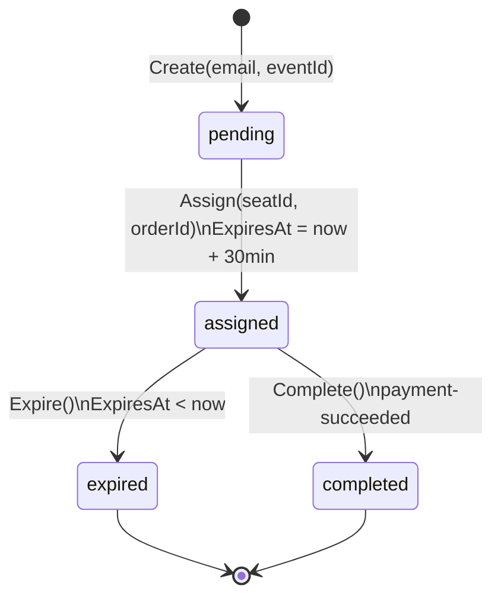

# 01 — Business Context

> **Fase SDLC:** Planificación + Análisis de Requisitos
> **Audiencia:** Negocio, Product Owner, Tech Lead

---

## El problema

### Situación actual (antes de la feature)

Una plataforma de ticketing tiene un momento de alta fricción: la reserva expira. Un usuario reservó un asiento, tuvo 15 minutos para completar el pago y no lo hizo. El asiento queda libre.

Lo que ocurría: ese asiento volvía al inventario disponible sin criterio alguno. El primer usuario en recargar la página y hacer clic lo obtenía. Esto se conoce como **F5 warfare** — una carrera donde gana quien tiene mejor conexión o más reflejos, no quien llegó primero.

```
Reserva expira
     │
     ▼
Asiento disponible → todos compiten simultáneamente
     │
     ├── Usuario A hace clic (gana)
     ├── Usuario B hace clic (pierde)
     ├── Usuario C hace clic (pierde)
     └── Usuario D... ya abandonó
```

### Consecuencias de negocio

| Problema | Impacto |
|---------|---------|
| Inequidad percibida | Usuarios frustrados abandonan la plataforma |
| Demanda insatisfecha sin capturar | No existe registro de quién quería comprar |
| "Stock fantasma" | Asientos que nadie termina de pagar se repiten en ciclos |
| Pérdida de conversión | Usuarios que querían comprar nunca encuentran el momento |

---

## La solución

La **Lista de Espera Inteligente** captura la demanda insatisfecha y la administra con equidad. Cuando un evento se agota, los usuarios pueden registrarse con su correo. El sistema mantiene un orden estricto de llegada (FIFO) y, cada vez que un asiento queda disponible, se lo ofrece automáticamente al primero en la cola — con un tiempo razonable para completar el pago.

```
Reserva expira
     │
     ▼
¿Hay alguien en cola?
     │
     ├── Sí → Primer usuario en cola recibe asignación automática
     │          + 30 minutos para pagar
     │          + notificación inmediata
     │
     └── No → Asiento vuelve al inventario disponible
```

### Impacto esperado

| Antes | Después |
|-------|---------|
| Asiento libre → carrera de clics | Asiento libre → oferta directa al primero en cola |
| Demanda insatisfecha sin registrar | Cada usuario interesado queda capturado |
| Usuario frustrado abandona | Usuario en cola recibe notificación y actúa |
| "Stock fantasma" recurrente | Rotación automática hasta agotar la cola |

### Motivación en una frase

> Un asiento que expira no es un asiento perdido — es una oportunidad que le pertenece a quien esperó más tiempo.

---

## Glosario del dominio

| Término | Definición |
|---------|-----------|
| **Lista de Espera** | Cola de usuarios interesados en un evento agotado |
| **Entrada en Lista de Espera** | Registro individual de un usuario en la cola de un evento |
| **Cola FIFO** | First In, First Out — el primero en registrarse es el primero en recibir asignación |
| **Asignación Automática** | El sistema selecciona al primero de la cola y le reserva el asiento sin intervención humana |
| **Ventana de Pago** | 30 minutos que tiene el usuario asignado para completar el pago |
| **Rotación de Asignación** | Cuando el usuario asignado no paga en 30 min, el asiento pasa al siguiente en cola |
| **Asiento Bloqueado** | Asiento retenido para la lista de espera durante la rotación — no vuelve al inventario disponible |
| **Inventario Disponible** | Asientos en estado `Available` accesibles para cualquier usuario |

---

## Entidades del dominio

### WaitlistEntry (Agregado Raíz)

Es la entidad central. Representa a un usuario en la cola de un evento específico y tiene su propio ciclo de vida.

```
Atributos:
├── Id: Guid              → identificador único
├── Email: string         → identifica al usuario (sin cuenta requerida)
├── EventId: Guid         → evento en el que espera
├── SeatId: Guid?         → asiento asignado (null si aún es pending)
├── OrderId: Guid?        → orden de compra generada (null si aún es pending)
├── Status: string        → estado actual en la máquina de estados
├── RegisteredAt          → timestamp de registro → define el orden FIFO
├── AssignedAt?           → timestamp de asignación
└── ExpiresAt?            → timestamp de expiración de la ventana de pago
```

### Máquina de estados



### Relaciones con otros bounded contexts

```
WaitlistEntry ──(EventId)──► Event        [bc_catalog]
WaitlistEntry ──(SeatId)───► Seat         [bc_inventory]
WaitlistEntry ──(OrderId)──► Order        [bc_ordering]
```

La entidad no importa esos objetos directamente — los referencia por ID. Cada servicio es autónomo.

---

## Reglas de negocio

| ID | Regla | Consecuencia si se viola |
|----|-------|--------------------------|
| **RN-01** | Un usuario solo puede tener una entrada activa (`pending` o `assigned`) por evento | `409 Conflict` — "Ya estás en la lista de espera" |
| **RN-02** | No se puede unir a la lista de espera si el evento tiene asientos disponibles | `409 Conflict` — "Hay tickets disponibles, realiza la compra directamente" |
| **RN-03** | La cola es FIFO estricto — ordenada por `RegisteredAt ASC` | El primero en registrarse siempre es el primero en recibir asignación |
| **RN-04** | El usuario asignado tiene exactamente 30 minutos para completar el pago | `ExpiresAt = AssignedAt + 30 min` — calculado en la entidad |
| **RN-05** | Si el tiempo expira y hay siguiente en cola, el asiento NO vuelve al inventario disponible | El asiento se rota directamente — sin pasar por `Available` |
| **RN-06** | Si el tiempo expira y la cola está vacía, el asiento se libera al inventario disponible | `IInventoryClient.ReleaseSeatAsync(seatId)` |

---

## Historias de Usuario

Las historias siguen el criterio **INVEST**: Independientes, Negociables, Valiosas, Estimables, Small, Testeables.

---

### HU-01 — Registro en Lista de Espera

```
Como  usuario que visualiza un evento agotado
Quiero  ingresar mi correo para unirme a la lista de espera
Para  ser considerado automáticamente si un asiento se libera
```

**Valor de negocio:** Captura demanda insatisfecha. Sin esta HU, los usuarios que no pudieron comprar simplemente se van — y la plataforma no sabe que existieron.

**Criterios INVEST:**
- *Independiente:* No depende de HU-02 para ser útil por sí sola
- *Valiosa:* Directamente reduce el abandono de usuarios
- *Testeable:* Puedo verificar que el registro ocurre y que el duplicado es rechazado

---

### HU-02 — Asignación Automática

```
Como  usuario en la cola de espera
Quiero  que el sistema me asigne un asiento automáticamente cuando uno se libere
Para  asegurar mi lugar sin competir nuevamente por el inventario
```

**Valor de negocio:** Elimina la "carrera de clics". El usuario que esperó recibe el asiento sin competencia.

---

### HU-03 — Rotación por Inacción

```
Como  sistema de gestión de la lista de espera
Quiero  detectar cuando un usuario asignado no completa el pago en 30 minutos
        y reasignar el asiento al siguiente en la cola sin liberarlo al inventario
Para  garantizar que ningún asiento quede sin convertirse en venta
      y que la equidad FIFO se mantenga durante todo el ciclo del asiento
```

**Valor de negocio:** Elimina el "stock fantasma" — asientos que nadie termina de pagar pero tampoco están disponibles para otros.

---

## Análisis de impacto sobre el sistema existente

La feature introduce un nuevo servicio (`Waitlist`) que se integra con tres servicios existentes. El contrato de comunicación es mínimo y no modifica la lógica de los servicios existentes.

```
Servicios que se modifican:
└── Inventory.ReservationExpiryWorker
    └── AGREGA: GET /api/v1/waitlist/has-pending?eventId={}
        Antes de liberar el asiento, pregunta si hay alguien esperando.
        Si Waitlist no responde en 200ms → libera el asiento igual.
        (Diseñado para no degradar Inventory si Waitlist falla)

Servicios que se consumen (sin modificarlos):
├── Catalog → GET /events/{id}/seatmap (verificar stock = 0)
├── Ordering → POST /orders/waitlist (crear orden automática)
└── Inventory → PUT /api/v1/seats/{id}/release (liberar si cola vacía)

Nuevo topic Kafka consumido (sin modificar productores):
├── reservation-expired (producido por Inventory, ya existía)
└── payment-succeeded (producido por Payment, ya existía)
```

**Principio aplicado:** Open/Closed — los servicios existentes están abiertos para extensión (Inventory ahora llama a Waitlist) pero cerrados para modificación (la lógica de Inventory no cambió, solo se agregó una llamada opcional con timeout).
