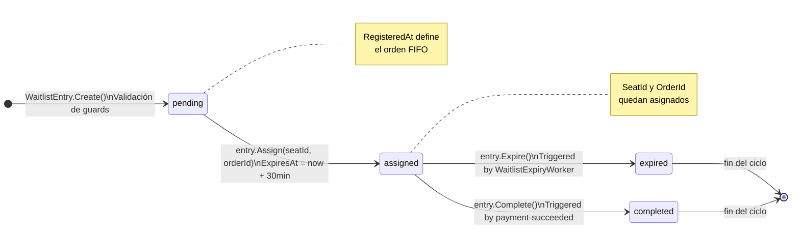

# 03 — Architecture Design

> **Fase SDLC:** Diseño
> **Audiencia:** Tech Lead, Dev Senior
> **Propósito:** Documentar las decisiones de diseño, su justificación y las alternativas descartadas

---

## Arquitectura Hexagonal aplicada al servicio

La arquitectura hexagonal (Ports & Adapters) garantiza que la lógica de negocio no dependa de detalles de infraestructura. El dominio no sabe nada de Kafka, PostgreSQL, HTTP ni Redis.

```
┌─────────────────────────────────────────────────────────┐
│                    ADAPTADORES (entrada)                │
│         WaitlistController  │  Kafka Consumers          │
│         POST /join          │  ReservationExpiredConsumer│
│         GET /has-pending    │  PaymentSucceededConsumer  │
└──────────────────┬──────────────────┬───────────────────┘
                   │ MediatR          │
┌──────────────────▼──────────────────▼───────────────────┐
│                   APLICACIÓN (casos de uso)             │
│   JoinWaitlistHandler                                   │
│   AssignNextHandler                                     │
│   CompleteAssignmentHandler                             │
│                                                         │
│   PUERTOS (interfaces):                                 │
│   IWaitlistRepository  IOrderingClient  IEmailService   │
│   ICatalogClient       IInventoryClient                 │
└──────────────────┬──────────────────────────────────────┘
                   │ depende de
┌──────────────────▼──────────────────────────────────────┐
│                     DOMINIO                             │
│   WaitlistEntry (agregado raíz)                        │
│   WaitlistConflictException                             │
│   WaitlistServiceUnavailableException                   │
└─────────────────────────────────────────────────────────┘
                   ▲
┌──────────────────┴──────────────────────────────────────┐
│                 ADAPTADORES (salida)                    │
│   WaitlistRepository (EF Core + PostgreSQL)             │
│   CatalogHttpClient    OrderingHttpClient               │
│   InventoryHttpClient  SmtpEmailService                 │
│   WaitlistExpiryWorker (IHostedService)                 │
└─────────────────────────────────────────────────────────┘
```

**Regla clave:** Las flechas de dependencia apuntan hacia adentro. El dominio no importa nada de infraestructura. La infraestructura implementa los puertos definidos en la aplicación.

---

## Los 5 puertos del servicio

```csharp
// Puerto 1: Persistencia propia
interface IWaitlistRepository {
    Task AddAsync(WaitlistEntry entry, CancellationToken ct);
    Task UpdateAsync(WaitlistEntry entry, CancellationToken ct);
    Task<WaitlistEntry?> GetNextPendingAsync(Guid eventId, CancellationToken ct);
    Task<WaitlistEntry?> GetByOrderIdAsync(Guid orderId, CancellationToken ct);
    Task<bool> HasActiveEntryAsync(string email, Guid eventId, CancellationToken ct);
    Task<bool> HasAssignedEntryForSeatAsync(Guid seatId, CancellationToken ct);
    Task<IEnumerable<WaitlistEntry>> GetExpiredAssignedAsync(CancellationToken ct);
    Task<int> GetQueuePositionAsync(Guid eventId, CancellationToken ct);
}

// Puerto 2: Consultar disponibilidad de asientos
interface ICatalogClient {
    Task<int> GetAvailableCountAsync(Guid eventId);
}

// Puerto 3: Crear y cancelar órdenes
interface IOrderingClient {
    Task<Guid> CreateWaitlistOrderAsync(Guid seatId, decimal price,
        string guestToken, Guid concertEventId);
    Task CancelOrderAsync(Guid orderId);
}

// Puerto 4: Liberar asiento al inventario
interface IInventoryClient {
    Task ReleaseSeatAsync(Guid seatId);
}

// Puerto 5: Enviar notificaciones
interface IEmailService {
    Task<bool> SendAsync(string to, string subject, string body,
        string? attachmentPath = null);
}
```

**Por qué 5 interfaces separadas (ISP):** Cada handler solo depende de los puertos que necesita. `JoinWaitlistHandler` solo usa `ICatalogClient` e `IWaitlistRepository`. `AssignNextHandler` solo usa `IWaitlistRepository`, `IOrderingClient` e `IEmailService`. Si agregara una interfaz gorda con todos los métodos, los handlers dependerían de métodos que no usan.

---

## Máquina de estados del agregado WaitlistEntry



### Guards de transición

Cada transición tiene un guard que lanza `InvalidOperationException` si el estado actual no es válido:

```
pending  → assigned  : SOLO desde pending
assigned → completed : SOLO desde assigned
assigned → expired   : SOLO desde assigned
```

Esta protección vive en la entidad, no en los handlers. La entidad garantiza sus propios invariantes.

---

## Architecture Decision Records (ADRs)

### ADR-W01 — WaitlistExpiryWorker interno vs. evento Kafka externo

**Contexto:** Para detectar que una asignación de 30 minutos venció, se necesita un mecanismo de trigger.

**Opciones consideradas:**
1. Que Ordering publique un evento `order-payment-timeout` cuando la orden no se paga
2. Un background worker dentro de Waitlist que haga polling de `ExpiresAt`

**Decisión:** Opción 2 — `WaitlistExpiryWorker` con polling cada 10 segundos.

**Razón:**
> La rotación de asignación es responsabilidad del dominio de Waitlist, no de Ordering. Si Ordering publicara ese evento, tendría que conocer el concepto de "asignación de lista de espera" — eso viola los límites del bounded context. Waitlist es dueño de sus propios timers y estados.

**Trade-off aceptado:** El polling introduce una latencia máxima de 10 segundos entre el vencimiento y la rotación. En el contexto de un proceso de 30 minutos, 10 segundos de latencia es aceptable.

---

### ADR-W02 — RegisteredAt como clave FIFO vs. campo Priority

**Contexto:** Necesito ordenar la cola para que el primero en registrarse sea el primero en recibir asignación.

**Opciones consideradas:**
1. Campo `Priority: int` en la entidad, asignado en el momento del registro
2. Ordenar directamente por `RegisteredAt ASC` en la consulta

**Decisión:** Opción 2 — no existe campo `Priority`.

**Razón:**
> `RegisteredAt` ya es la fuente de verdad del orden de llegada. Un campo `Priority` sería un dato derivado de `RegisteredAt` — redundante. Generaría doble mantenimiento: actualizar `Priority` cuando cambia el orden (por cancelaciones, por ejemplo) introduciría bugs. `ORDER BY RegisteredAt ASC` es simple, correcto y eficiente con el índice `idx_waitlist_fifo`.

---

### ADR-W03 — ExpiresAt explícito en la entidad vs. cálculo en memoria

**Contexto:** El worker necesita saber cuándo vence una asignación.

**Opciones consideradas:**
1. Calcular `AssignedAt + 30min` en memoria en el worker
2. Persistir `ExpiresAt` como columna en la base de datos

**Decisión:** Opción 2 — `ExpiresAt` es una columna persistida con índice filtrado.

**Razón:**
> Con `ExpiresAt` como columna, la consulta del worker es `WHERE Status='assigned' AND ExpiresAt <= NOW()` — que usa el índice `idx_waitlist_expiry` y solo toca las filas relevantes. Si calculara en memoria, tendría que traer todas las filas `assigned` y filtrar en la aplicación — escaneo de tabla completo. Además, `ExpiresAt` hace explícita la información en la entidad, lo que facilita debugging y auditoría.

---

### ADR-W04 (del sistema) — HTTP síncrono de Inventory → Waitlist con 200ms timeout

**Contexto:** Cuando `ReservationExpiryWorker` en Inventory detecta una reserva expirada, necesita saber si hay alguien en lista de espera antes de liberar el asiento.

**Decisión:** Llamada HTTP GET con timeout de 200ms.

**Razón:**
> Si el timeout fuera largo, Inventory se bloquearía esperando respuesta de Waitlist, degradando el TTL de reservas. Con 200ms: si Waitlist responde → Inventory retiene el asiento para Waitlist. Si Waitlist no responde → Inventory libera el asiento al inventario disponible. Waitlist eventualmente consumirá `reservation-expired` de Kafka, pero encontrará que no hay asiento para asignar. Esta degradación controlada es preferible a bloquear Inventory.

---

## Contratos de Kafka

### Consume: `reservation-expired`

```json
{
  "messageId":     "Guid",
  "reservationId": "Guid",
  "seatId":        "Guid",
  "customerId":    "string (optional)",
  "concertEventId": "Guid"
}
```

**Nota de versioning:** El campo `concertEventId` fue agregado en v3. El consumer valida su presencia y descarta silenciosamente mensajes v2 (sin `concertEventId`) — compatibilidad hacia atrás.

---

### Consume: `payment-succeeded`

```json
{
  "orderId": "Guid"
}
```

El consumer extrae el `orderId` y despacha `CompleteAssignmentCommand`. Idempotente: si no hay entrada con ese `orderId`, no hace nada.

---

## Schema de base de datos

**Schema:** `bc_waitlist`

```sql
CREATE TABLE waitlist_entries (
    "Id"           UUID                     NOT NULL PRIMARY KEY,
    "Email"        VARCHAR(320)             NOT NULL,
    "EventId"      UUID                     NOT NULL,
    "SeatId"       UUID,
    "OrderId"      UUID,
    "Status"       VARCHAR(20)              NOT NULL,
    "RegisteredAt" TIMESTAMP WITH TIME ZONE NOT NULL,
    "AssignedAt"   TIMESTAMP WITH TIME ZONE,
    "ExpiresAt"    TIMESTAMP WITH TIME ZONE
);
```

### Índices y su justificación

```sql
-- FIFO: obtener el siguiente pending por evento en orden de llegada
-- Usado por: GetNextPendingAsync(), GetQueuePositionAsync()
CREATE INDEX idx_waitlist_fifo
ON waitlist_entries ("EventId", "Status", "RegisteredAt");

-- Expiry scan: solo toca filas assigned — no escanea la tabla completa
-- Usado por: WaitlistExpiryWorker.GetExpiredAssignedAsync()
CREATE INDEX idx_waitlist_expiry
ON waitlist_entries ("ExpiresAt")
WHERE "Status" = 'assigned';

-- Payment lookup: encuentra la entrada por su orden de compra
-- Usado por: CompleteAssignmentHandler.GetByOrderIdAsync()
CREATE INDEX idx_waitlist_order
ON waitlist_entries ("OrderId")
WHERE "OrderId" IS NOT NULL;
```

Cada índice tiene un `WHERE` clause donde corresponde — índices parciales que solo indexan las filas relevantes para la consulta. Más eficientes que índices completos.

---

## Principios SOLID aplicados

| Principio | Aplicación concreta |
|-----------|---------------------|
| **S** — Single Responsibility | `JoinWaitlistHandler` registra. `AssignNextHandler` asigna. `WaitlistExpiryWorker` rota. Cada clase tiene una sola razón para cambiar. |
| **O** — Open/Closed | Para cambiar el canal de notificación (SMS en lugar de email), implemento `SmsNotificationService : IEmailService` sin modificar ningún handler. |
| **L** — Liskov Substitution | `SmtpEmailService` y el mock en tests implementan `IEmailService`. Son intercambiables sin romper el comportamiento del handler. |
| **I** — Interface Segregation | 5 interfaces específicas. `CompleteAssignmentHandler` solo depende de `IWaitlistRepository` — no sabe de `ICatalogClient` ni `IOrderingClient`. |
| **D** — Dependency Inversion | Los handlers reciben interfaces por constructor injection. Nunca instancian `WaitlistRepository` ni `CatalogHttpClient` directamente. |
