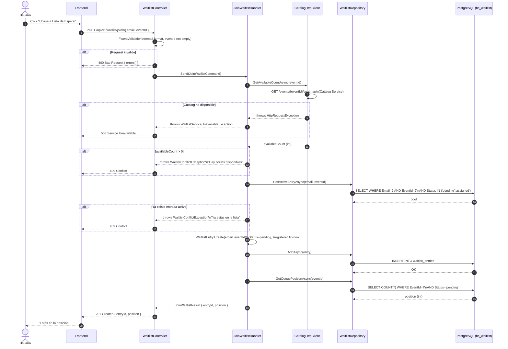
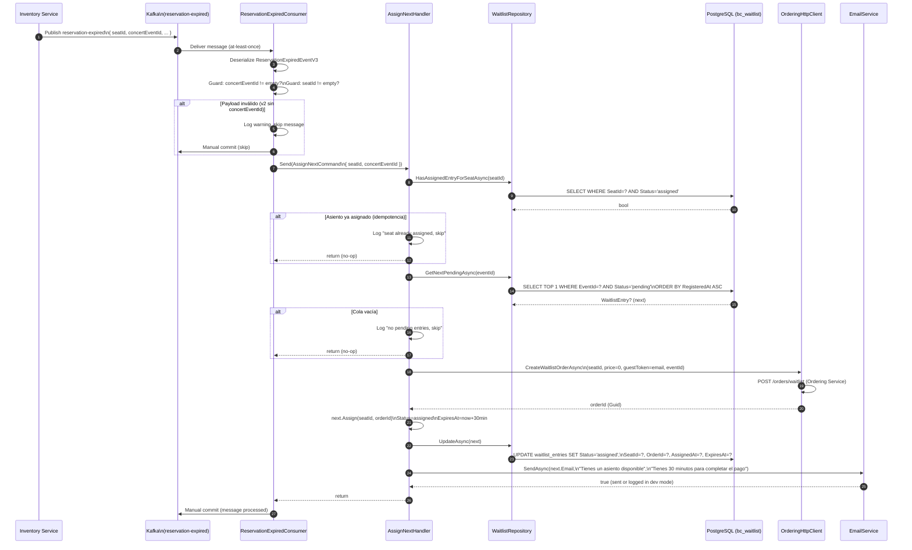
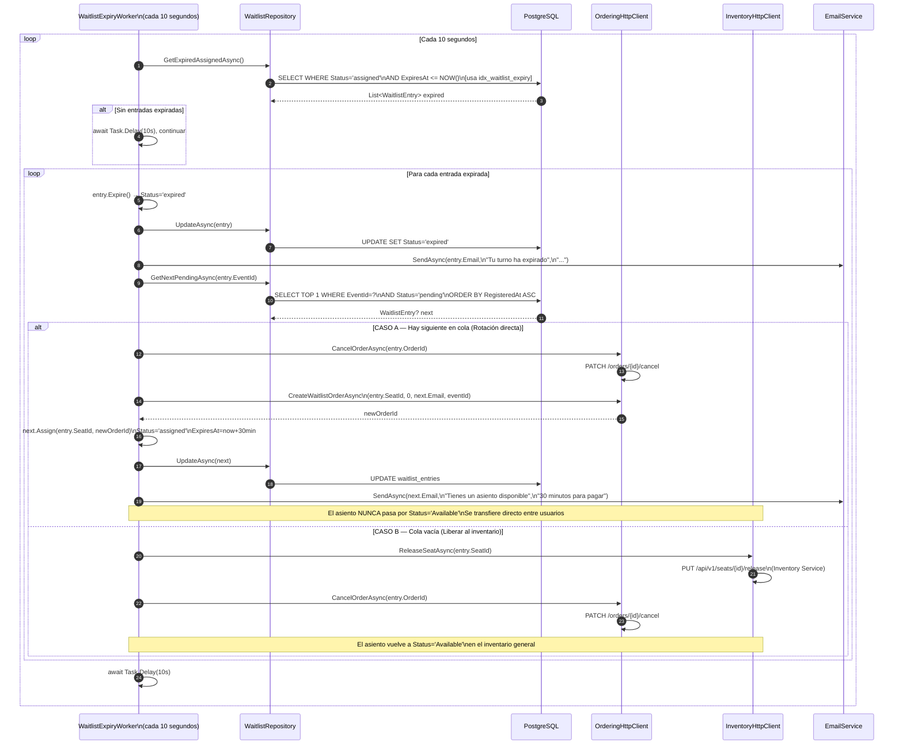
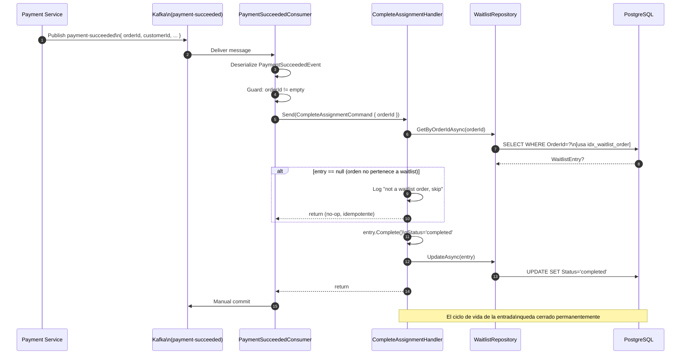
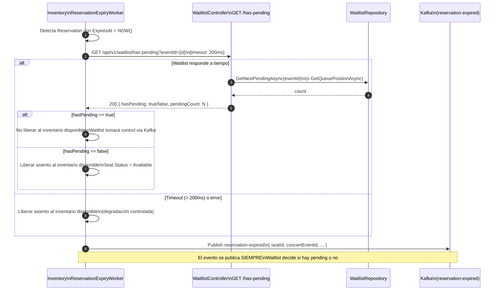

# 04 — Sequence Diagrams

> **Fase SDLC:** Diseño
> **Audiencia:** Dev, QA
> **Propósito:** Visualizar el flujo de mensajes y responsabilidades entre componentes para cada escenario principal

---

## Flujo 1 — Registro en Lista de Espera (HU-01)

**Trigger:** Usuario hace POST /api/v1/waitlist/join
**Participantes:** Frontend → Controller → Handler → CatalogClient → Repository

---

## Flujo 2 — Asignación Automática (HU-02)

**Trigger:** Evento `reservation-expired` llega desde Kafka (publicado por Inventory)
**Participantes:** Kafka → Consumer → Handler → Repository → OrderingClient → EmailService

---

## Flujo 3 — Rotación de Asignación (HU-03)

**Trigger:** `WaitlistExpiryWorker` corre cada 10 segundos y encuentra entradas con `ExpiresAt < NOW()`
**Dos caminos:** A) Hay siguiente en cola → rotación directa | B) Cola vacía → liberar asiento

---

## Flujo 4 — Completar Asignación por Pago (HU-02 / HU-03)

**Trigger:** Evento `payment-succeeded` llega desde Kafka (publicado por Payment Service)
**Propósito:** Cerrar el ciclo de vida de la entrada cuando el usuario de la waitlist completa el pago

---

## Flujo 5 — ADR-03: Inventory consulta Waitlist antes de liberar asiento

**Trigger:** `ReservationExpiryWorker` en Inventory detecta reserva expirada
**Propósito:** Decidir si retener el asiento para Waitlist o liberarlo al inventario disponible

**Nota importante:** Inventory publica `reservation-expired` independientemente del resultado de `has-pending`. Waitlist recibe el evento y si no hay pendientes, simplemente no hace nada. La consulta HTTP es una optimización de UX (retener el asiento), no un control de flujo crítico.
