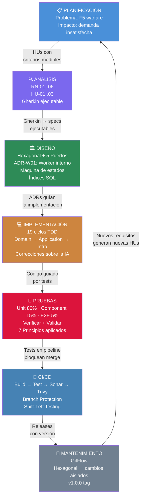

# 07 — SDLC Narrative

> **Fase:** Ciclo completo
> **Audiencia:** Evaluador técnico, Tech Lead
> **Propósito:** Conectar todas las fases del SDLC en una narrativa coherente que demuestre pensamiento full-cycle

---

## El SDLC como historia continua

Un ingeniero full-cycle no es alguien que sabe hacer muchas cosas por separado. Es alguien que entiende **cómo cada fase alimenta a la siguiente** y puede tomar decisiones en cualquier punto del ciclo con visión del todo.

Esta narrativa describe cómo la feature de Lista de Espera transitó por cada fase del SDLC y qué decisiones se tomaron en cada punto.

---

## Fase 1 — Planificación: el problema antes de la solución

La planificación no empieza con "qué vamos a construir". Empieza con "qué problema existe que todavía no resolvemos".

El problema identificado fue concreto: cuando una reserva de asiento expira, el sistema no tiene un mecanismo justo para decidir a quién le corresponde ese asiento. El resultado es una "carrera de clics" — inequitativa, frustrante y que deja demanda insatisfecha sin capturar.

**La planificación produjo:**
- Identificación del problema de negocio (no la solución técnica)
- Motivación en términos de impacto: tasa de conversión en asientos recuperados
- Límites del problema: qué está en scope (cola FIFO, asignación automática, rotación) y qué no (escala a 10k usuarios/min, autenticación avanzada)

**Decisión en esta fase:** No saltar a la arquitectura. El documento de planificación es narrativo, no técnico.

---

## Fase 2 — Análisis: del problema a los requisitos

El análisis traduce el problema en requisitos concretos, verificables y priorizados. Aquí se toman dos artefactos:

**Reglas de negocio (RN-01 a RN-06):** definen el comportamiento esperado del sistema de forma precisa. Son el contrato con el negocio.

**Historias de Usuario (HU-01 a HU-03):** articulan el valor desde la perspectiva del usuario. Siguen el criterio INVEST — cada HU es independiente, valiosa y testeable.

**El puente entre análisis e implementación:** los **criterios de aceptación en Gherkin**. Un criterio de aceptación en Gherkin es simultáneamente:
- Lenguaje que el negocio puede validar
- Especificación ejecutable que el código debe cumplir

```
RN-05: Asiento no liberado durante rotación
         ↓
HU-03: Sistema detecta inacción y reasigna sin liberar al inventario
         ↓
Gherkin ESC-05: "Y el asiento NO vuelve al inventario disponible"
         ↓
Test Ciclo 17: _inventoryMock.Verify(ReleaseSeatAsync, Times.Never)
```

Esa cadena de trazabilidad — de regla de negocio a línea de código — es la columna vertebral del SDLC bien aplicado.

---

## Fase 3 — Diseño: decisiones que sobreviven al código

El diseño no es dibujar cajas y flechas. Es tomar decisiones que tendrán consecuencias durante meses y documentarlas para que sean entendidas por el equipo.

Tres decisiones de diseño marcaron la implementación:

**Decisión 1 — Arquitectura Hexagonal:**
La lógica de negocio no puede depender de infraestructura. Si mañana Kafka se reemplaza por RabbitMQ, o PostgreSQL por MongoDB, los handlers no deben cambiar. Los 5 puertos (`IWaitlistRepository`, `ICatalogClient`, `IOrderingClient`, `IInventoryClient`, `IEmailService`) son la frontera entre el dominio y el mundo externo.

*Consecuencia medible:* Los unit tests no necesitan base de datos ni red. Se ejecutan en milisegundos. Esto hace el ciclo TDD viable — no puedes hacer TDD efectivo si cada test tarda 5 segundos en arrancar.

**Decisión 2 — WaitlistExpiryWorker interno vs. evento externo:**
El diseño original propuso que Ordering publicara un evento `order-payment-timeout`. La corrección fue implementar el worker dentro de Waitlist. La razón: la rotación de asignación es un invariante del dominio de Waitlist — Ordering no debe conocer ese concepto.

*Consecuencia medible:* Ordering no tiene ninguna referencia al concepto de lista de espera. El bounded context está limpio.

**Decisión 3 — ExpiresAt como columna persistida con índice filtrado:**
El worker necesita encontrar rápidamente qué asignaciones vencieron. Con `ExpiresAt` como columna y el índice `idx_waitlist_expiry` filtrado `WHERE Status='assigned'`, la consulta es eficiente incluso con miles de entradas.

*Consecuencia medible:* El índice partial cubre solo las filas relevantes. En producción con 100k entradas, solo una fracción pequeña está en estado `assigned` en cualquier momento dado.

---

## Fase 4 — Implementación: TDD como disciplina, no como trámite

La implementación siguió un orden deliberado: Dominio → Aplicación → Infraestructura.

**¿Por qué ese orden?**

El dominio no tiene dependencias externas — puede implementarse y probarse de forma completamente aislada. Si empiezas por la infraestructura, las decisiones de bajo nivel contaminan el diseño del dominio.

Los 19 ciclos TDD documentados no son un registro burocrático. Son la evidencia de que el código fue construido con intención:

```
Ciclos 1-6:  La entidad WaitlistEntry primero
             → El dominio existe antes que cualquier handler

Ciclos 7-11: JoinWaitlistHandler
             → Cada guard clause tiene su propio ciclo RED/GREEN

Ciclos 12-16: AssignNext + CompleteAssignment
              → Idempotencia probada explícitamente

Ciclos 17-19: WaitlistExpiryWorker
              → La regla más crítica (RN-05) tiene un Verify(Times.Never)
```

**La corrección humana más importante:**

En el Ciclo 17, el test original verificaba que la rotación ocurría. La revisión agregó `_inventoryMock.Verify(ReleaseSeatAsync, Times.Never)` — confirmar que el asiento **no** fue liberado. Sin ese assertion, el test pasaría incluso si el código liberara el asiento al inventario. El test negativo es tan importante como el positivo.

---

## Fase 5 — Pruebas: la pirámide como estrategia

Las pruebas no son un step que ocurre al final. En TDD, las pruebas son el step que ocurre **primero**.

La pirámide de pruebas de esta feature refleja el costo y la velocidad de cada nivel:

```
Unit Tests   → Baratos, rápidos, muchos  → 80% de los casos están aquí
Component    → Moderados, medianos       → Validan el ensamblaje de capas
E2E          → Costosos, lentos, pocos   → Solo el flujo crítico completo
```

**El Principio 6 (pruebas dependen del contexto) aplicado:**

En `WaitlistExpiryWorker` la prioridad es probar que la rotación no libera el asiento al inventario — ese es el riesgo de negocio más alto. En `NotificationService` la prioridad es la idempotencia — no enviar el mismo email dos veces. Cada componente tiene su contexto de riesgo, y los tests priorizan ese riesgo.

**Verificar vs. Validar en la práctica:**

```csharp
// VALIDAR — la regla de negocio se cumplió
next.Status.Should().Be(WaitlistEntry.StatusAssigned);

// VERIFICAR — el puerto fue invocado correctamente
_repoMock.Verify(r => r.UpdateAsync(next, default), Times.Once);
```

La diferencia importa: un test que solo valida el estado podría pasar aunque el cambio nunca se persista. Un test que solo verifica el puerto podría pasar aunque el estado del dominio sea incorrecto. Los dos juntos son la prueba completa.

---

## Fase 6 — CI/CD: el ciclo automatizado

El CI/CD no es un proceso separado del desarrollo — es la automatización del ciclo de calidad.

Cada vez que se hace un commit en la rama de la feature:

```
push → GitHub Actions detecta cambios en services/waitlist/
     → dotnet build (¿compila?)
     → dotnet test --collect coverage (¿tests en verde? ¿cobertura > 85%?)
     → SonarCloud analysis (¿deuda técnica? ¿code smells?)
     → docker build (¿imagen construible?)
     → trivy scan (¿vulnerabilidades CRITICAL/HIGH?)
     → PR puede ser mergeado solo si todos los steps pasan
```

**Shift-Left en acción:** Los problemas se detectan en el primer commit, no en producción. El costo de corregir un bug encontrado en el pipeline es órdenes de magnitud menor que uno encontrado en producción.

**La decisión de Branch Protection:** No es una opción — es un contrato de calidad del equipo. Nadie puede mergear a `develop` código que rompa los checks. Ni siquiera el tech lead.

---

## Fase 7 — Mantenimiento: el código que perdura

Un sistema bien construido no es más difícil de mantener que uno mal construido — es más fácil. La arquitectura hexagonal garantiza que:

- Cambiar el canal de notificación (SMTP → SendGrid) requiere modificar solo `SmtpEmailService`, no los handlers
- Cambiar el proveedor de mensajería (Kafka → RabbitMQ) requiere modificar solo los consumers, no la lógica de negocio
- Agregar un nuevo caso de uso (ej: prioridad VIP en la cola) requiere un nuevo handler y un nuevo puerto, sin tocar los existentes

**GitFlow como proceso de mantenimiento:**

```
Feature nueva      → feature/waitlist-autoassign → develop → main
Bug en producción  → hotfix/seat-release-bug     → main + develop
Release            → tag v1.0.0 en main
```

El historial de Git cuenta la historia del proyecto. Cada PR documentado, cada merge bien nombrado, es parte de la documentación del sistema.

---

## El ciclo completo en una sola imagen



---

## Reflexión: simbiosis Humano-IA en el SDLC

La IA fue una herramienta en cada fase del ciclo, no un sustituto del criterio de ingeniería.

| Fase | Contribución de la IA | Corrección humana |
|------|----------------------|-----------------|
| Análisis | Generó borradores de HUs y Gherkin | Refiné los criterios para que reflejen RN-05 con precisión |
| Diseño | Propuso `order-payment-timeout` desde Ordering | Cambié a `WaitlistExpiryWorker` interno por bounded context |
| Diseño | Propuso campo `Priority: int` | Eliminé — `RegisteredAt ASC` es la fuente de verdad |
| Implementación | Generó estructura de handlers y tests | Agregué `Verify(Times.Never)` en Ciclo 17 — el assertion crítico |
| CI/CD | Generó el YAML base del pipeline | Ajusté jobs para que sean separados (componente vs. integración) |

**El criterio de corrección:** No "la IA se equivocó" — sino "esta decisión tiene consecuencias en el bounded context / en los tests / en la mantenibilidad que la IA no consideró por no tener el contexto completo del sistema".

Esa es la diferencia entre un ingeniero que usa IA y uno que delega a la IA.
