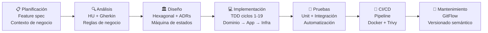

# Waitlist Feature — Full-Cycle Engineering Portfolio

> **Proyecto:** SpecKit Ticketing Platform
> **Feature:** Sistema de Lista de Espera Inteligente
> **Autor:** Jostin Enrique Alvarado Sarmiento
> **Ciclo:** Semana 6 (diseño) → Semana 7 (implementación)

---

## Cómo navegar este documento

Este portfolio está organizado siguiendo el **SDLC completo** aplicado a una sola feature. Cada sección es un artefacto de una fase del ciclo. Puedes leerlo de forma lineal (de negocio a implementación) o saltar a la sección que te interese.

```
PROBLEMA DE NEGOCIO
      │
      ▼
01-business-context.md      ← ¿Por qué existe esta feature?
      │
      ▼
02-acceptance-criteria.md   ← ¿Qué debe hacer exactamente?
      │
      ▼
03-architecture-design.md   ← ¿Cómo se diseñó la solución?
      │
      ▼
04-sequence-diagrams.md     ← ¿Cómo fluye el sistema en cada escenario?
      │
      ▼
05-test-plan.md             ← ¿Cómo se verifica y valida?
      │
      ▼
06-tdd-evidence.md          ← ¿Cómo se construyó con disciplina TDD?
      │
      ▼
07-sdlc-narrative.md        ← ¿Cómo se conecta todo el ciclo?
```

---

## Mapa SDLC — Vista General



---

## Trazabilidad completa

La tabla de trazabilidad conecta cada regla de negocio con su historia de usuario, su escenario de prueba y el código que la implementa.

| Regla | Historia | Escenario Gherkin | Handler / Entidad | Test |
|-------|----------|-------------------|-------------------|------|
| RN-01 Una entrada por usuario/evento | HU-01 | ESC-03 | `JoinWaitlistHandler` + guard | `Handle_DuplicateActiveEntry_ThrowsConflict` |
| RN-02 No unirse si hay stock | HU-01 | ESC-02 | `JoinWaitlistHandler` + `ICatalogClient` | `Handle_StockAvailable_ThrowsConflict` |
| RN-03 Cola FIFO | HU-02 | ESC-04 | `GetNextPendingAsync` → `ORDER BY RegisteredAt ASC` | `Handle_PendingEntryExists_AssignsFirst` |
| RN-04 Ventana de 30 min | HU-03 | ESC-05/06 | `WaitlistEntry.Assign()` → `ExpiresAt = now + 30min` | `Assign_SetsExpiresAt30MinutesAhead` |
| RN-05 Asiento no liberado en rotación | HU-03 | ESC-05 | `WaitlistExpiryWorker.RotateOrRelease()` | `ProcessExpired_NextExists_RotatesWithoutRelease` |
| RN-06 Liberar si cola vacía | HU-03 | ESC-06 | `IInventoryClient.ReleaseSeatAsync()` | `ProcessExpired_EmptyQueue_ReleasesSeat` |

---

## Decisiones clave (resumen ejecutivo)

| Decisión | Alternativa descartada | Razón |
|----------|----------------------|-------|
| `WaitlistExpiryWorker` (polling interno) | Evento Kafka `order-payment-timeout` desde Ordering | La rotación es responsabilidad de Waitlist — no debe acoplar Ordering al concepto de lista de espera |
| `RegisteredAt ASC` para FIFO | Campo `Priority: int` | `RegisteredAt` es la fuente de verdad; `Priority` sería dato derivado y redundante |
| `ExpiresAt` explícito en entidad | Calcular `AssignedAt + 30min` en memoria | Permite índice SQL filtrado para el worker — eficiencia de consulta |
| 5 puertos (interfaces) en Application | Acceso directo a infraestructura | Permite mockear en tests sin infraestructura real; cumple DIP de SOLID |

---

## Stack de esta feature

| Capa | Tecnología | Rol |
|------|-----------|-----|
| API | .NET 9 Minimal APIs + Controllers | Expone `POST /join` y `GET /has-pending` |
| Application | MediatR (CQRS) | `JoinWaitlistHandler`, `AssignNextHandler`, `CompleteAssignmentHandler` |
| Domain | C# POCO con guardianes | `WaitlistEntry` — máquina de estados con invariantes |
| Infrastructure | EF Core + PostgreSQL | Persistencia en schema `bc_waitlist` |
| Messaging | Apache Kafka | Consume `reservation-expired` y `payment-succeeded` |
| Background | `IHostedService` | `WaitlistExpiryWorker` — polling cada 10s |
| Tests | xUnit + Moq + FluentAssertions | 19 ciclos TDD documentados |

---

## Índice de documentos

| Documento | Fase SDLC | Audiencia principal |
|-----------|----------|---------------------|
| [01 — Business Context](./01-business-context.md) | Planificación + Análisis | Negocio, Product Owner |
| [02 — Acceptance Criteria](./02-acceptance-criteria.md) | Análisis + QA | QA, Dev, Negocio |
| [03 — Architecture Design](./03-architecture-design.md) | Diseño | Tech Lead, Dev |
| [04 — Sequence Diagrams](./04-sequence-diagrams.md) | Diseño | Dev, QA |
| [05 — Test Plan](./05-test-plan.md) | Pruebas | QA, Tech Lead |
| [06 — TDD Evidence](./06-tdd-evidence.md) | Implementación | Dev, Tech Lead |
| [07 — SDLC Narrative](./07-sdlc-narrative.md) | Ciclo completo | Evaluador, Tech Lead |
