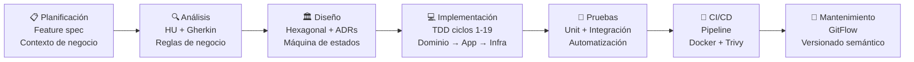

# Waitlist Feature — Full-Cycle Engineering Portfolio

> **Proyecto:** SpecKit Ticketing Platform
> **Feature:** Sistema de Lista de Espera Inteligente
> **Autor:** Jostin Enrique Alvarado Sarmiento
> **Ciclo:** Semana 6 (diseño) → Semana 7 (implementación)

---

## Guía de navegación para la sustentación

El examen se divide en 3 bloques. Cada bloque tiene documentos específicos de respaldo.

### Bloque A — Auditoría de Ingeniería Core y Pirámide de Testing
> *"Mostrar en código la relación con el diseño, el patrón táctico aplicado y defender la pirámide de testing"*

| Pregunta del evaluador | Documento de respaldo |
|------------------------|----------------------|
| ¿Cómo pasaste del diseño al código? | [08 — Diseño vs. Implementación](./08-design-vs-implementation.md) |
| ¿Dónde está la frontera dominio/infraestructura? | [03 — Architecture Design](./03-architecture-design.md) — sección Hexagonal |
| ¿Qué patrón táctico aplicaste y por qué? | [03 — Architecture Design](./03-architecture-design.md) — sección Máquina de estados + SOLID |
| ¿Cuál es tu pirámide de testing? | [05 — Test Plan](./05-test-plan.md) — sección Pirámide |
| Elige un test y explícame qué se mockea y por qué | [05 — Test Plan](./05-test-plan.md) — sección "Por qué mockeamos lo que mockeamos" |
| ¿Cuál es la diferencia entre Verificar y Validar? | [05 — Test Plan](./05-test-plan.md) — sección "Verificar vs. Validar" |

---

### Bloque B — Demostración de Calidad Automatizada E2E/API
> *"Los 3 repos de automatización se ejecutan y generan reportes de Serenity"*

Este bloque se defiende desde los repositorios `AUTO_FRONT_POM_FACTORY`, `AUTO_FRONT_SCREENPLAY` y `AUTO_API_SCREENPLAY`. El plan de pruebas del servicio está en:

| Pregunta del evaluador | Documento de respaldo |
|------------------------|----------------------|
| ¿Qué cubre cada nivel de prueba? | [05 — Test Plan](./05-test-plan.md) — sección Niveles de prueba |
| ¿Cómo se ven los escenarios Gherkin de la feature? | [02 — Acceptance Criteria](./02-acceptance-criteria.md) |
| ¿Los escenarios son declarativos o imperativos? | [02 — Acceptance Criteria](./02-acceptance-criteria.md) — ver ESC-01 a ESC-06 |

---

### Bloque C — Defensa de Simbiosis Humano-IA
> *"¿Qué corregiste? ¿Qué rechazaste? ¿Qué no pudiste resolver con la IA?"*

| Pregunta del evaluador | Documento de respaldo |
|------------------------|----------------------|
| Dame un ejemplo concreto donde corregiste a la IA | [08 — Diseño vs. Implementación](./08-design-vs-implementation.md) — Cambio 2 (trigger de rotación) |
| ¿Por qué diseñaste así y no como sugería la IA? | [03 — Architecture Design](./03-architecture-design.md) — ADR-W01 |
| Conecta negocio → QA → Dev en un solo hilo | [SDLC-NARRATIVE.md](./SDLC-NARRATIVE.md) |
| ¿Cómo se conecta todo el SDLC? | [07 — SDLC Narrative](./07-sdlc-narrative.md) |

---

### Lectura lineal (de negocio a implementación)

```
PROBLEMA DE NEGOCIO
      │
      ▼
01-business-context.md      ← ¿Por qué existe esta feature?
      │
      ▼
02-acceptance-criteria.md   ← ¿Qué debe hacer exactamente?
      │
      ▼
03-architecture-design.md   ← ¿Cómo se diseñó la solución?
      │
      ▼
04-sequence-diagrams.md     ← ¿Cómo fluye el sistema en cada escenario?
      │
      ▼
05-test-plan.md             ← ¿Cómo se verifica y valida?
      │
      ▼
06-tdd-evidence.md          ← ¿Cómo se construyó con disciplina TDD?
      │
      ▼
07-sdlc-narrative.md        ← ¿Cómo se conecta todo el ciclo?
      │
      ▼
08-design-vs-implementation ← ¿Qué cambió del diseño al código y por qué?
```

---

## Mapa SDLC — Vista General



---

## Trazabilidad completa

La tabla de trazabilidad conecta cada regla de negocio con su historia de usuario, su escenario de prueba y el código que la implementa.

| Regla | Historia | Escenario Gherkin | Handler / Entidad | Test |
|-------|----------|-------------------|-------------------|------|
| RN-01 Una entrada por usuario/evento | HU-01 | ESC-03 | `JoinWaitlistHandler` + `HasActiveEntryAsync` | `Handle_DuplicateActiveEntry_ThrowsWaitlistConflictException` |
| RN-02 No unirse si hay stock | HU-01 | ESC-02 | `JoinWaitlistHandler` + `ICatalogClient` | `Handle_StockAvailable_ThrowsWaitlistConflictException` |
| RN-03 Cola FIFO | HU-02 | ESC-04 | `GetNextPendingAsync` → `ORDER BY RegisteredAt ASC` | `Handle_PendingEntryExists_AssignsEntryAndSendsEmail` |
| RN-04 Ventana de 30 min | HU-02/03 | ESC-04/05 | `WaitlistEntry.Assign()` → `ExpiresAt = now + 30min` | `Assign_WhenPending_SetsStatusAssignedAndTimestamps` |
| RN-05 Asiento no liberado en rotación | HU-03 | ESC-05 | `WaitlistExpiryWorker` — rotación directa | `ProcessExpired_WithNextPending_ExpiresCurrentAndAssignsNext` |
| RN-06 Liberar si cola vacía | HU-03 | ESC-06 | `IInventoryClient.ReleaseSeatAsync()` | `ProcessExpired_EmptyQueue_ReleasesSeatAndCancelsOrder` |

---

## Decisiones clave (resumen ejecutivo)

| Decisión | Alternativa descartada | Razón |
|----------|----------------------|-------|
| `WaitlistExpiryWorker` (polling interno) | Evento Kafka `order-payment-timeout` desde Ordering | La rotación es responsabilidad de Waitlist — no debe acoplar Ordering al concepto de lista de espera |
| `RegisteredAt ASC` para FIFO | Campo `Priority: int` | `RegisteredAt` es la fuente de verdad; `Priority` sería dato derivado y redundante |
| `ExpiresAt` explícito en entidad | Calcular `AssignedAt + 30min` en memoria | Permite índice SQL filtrado para el worker — eficiencia de consulta |
| 5 puertos (interfaces) en Application | Acceso directo a infraestructura | Permite mockear en tests sin infraestructura real; cumple DIP de SOLID |

---

## Stack de esta feature

| Capa | Tecnología | Rol |
|------|-----------|-----|
| API | .NET 9 Minimal APIs + Controllers | Expone `POST /join` y `GET /has-pending` |
| Application | MediatR (CQRS) | `JoinWaitlistHandler`, `AssignNextHandler`, `CompleteAssignmentHandler` |
| Domain | C# POCO con guardianes | `WaitlistEntry` — máquina de estados con invariantes |
| Infrastructure | EF Core + PostgreSQL | Persistencia en schema `bc_waitlist` |
| Messaging | Apache Kafka | Consume `reservation-expired` y `payment-succeeded` |
| Background | `IHostedService` | `WaitlistExpiryWorker` — polling cada 10s |
| Tests | xUnit + Moq + FluentAssertions | 19 ciclos TDD documentados |

---

## Cierre ejecutivo — para la sustentación oral

> *"Cuéntame qué construiste, cómo lo protegiste y qué garantiza su calidad."*

Construí el **Sistema de Lista de Espera Inteligente**: un microservicio independiente que resuelve el problema de equidad cuando un asiento expirado vuelve al mercado. En lugar de una carrera de clics, el primero en registrarse es el primero en recibir el asiento — automáticamente, sin que el usuario tenga que hacer nada.

Lo protegí en tres niveles: **dominio** con una máquina de estados que hace imposible los estados inválidos (`WaitlistEntry` no puede completarse si nunca fue asignada), **aplicación** con 5 puertos que aislan la lógica de negocio de cualquier infraestructura, y **tests** con 19 ciclos TDD donde la regla más crítica — que el asiento no vuelva al inventario durante la rotación — está protegida por un `Verify(Times.Never)` que no puede pasar si el código falla.

Su calidad está garantizada por el pipeline CI/CD que bloquea cualquier merge que rompa los tests, supere el umbral de cobertura, introduzca vulnerabilidades CRITICAL/HIGH en la imagen Docker, o viole las restricciones de arquitectura hexagonal. Las 6 reglas de negocio no son documentos — son tests que corren en cada commit.

---

## Índice de documentos

| Documento | Fase SDLC | Audiencia principal |
|-----------|----------|---------------------|
| [01 — Business Context](./01-business-context.md) | Planificación + Análisis | Negocio, Product Owner |
| [02 — Acceptance Criteria](./02-acceptance-criteria.md) | Análisis + QA | QA, Dev, Negocio |
| [03 — Architecture Design](./03-architecture-design.md) | Diseño | Tech Lead, Dev |
| [04 — Sequence Diagrams](./04-sequence-diagrams.md) | Diseño | Dev, QA |
| [05 — Test Plan](./05-test-plan.md) | Pruebas | QA, Tech Lead |
| [06 — TDD Evidence](./06-tdd-evidence.md) | Implementación | Dev, Tech Lead |
| [07 — SDLC Narrative](./07-sdlc-narrative.md) | Ciclo completo | Evaluador, Tech Lead |
| [08 — Diseño vs. Implementación](./08-design-vs-implementation.md) | Implementación | Evaluador, Sustentación |
