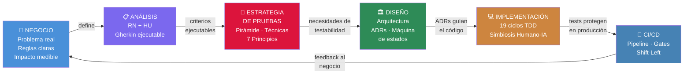
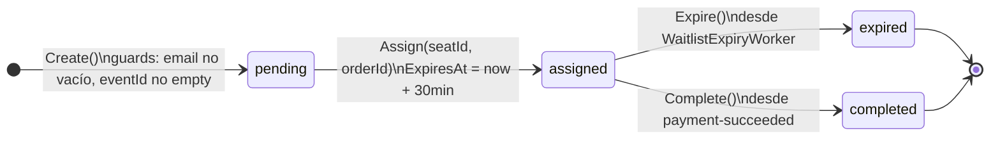
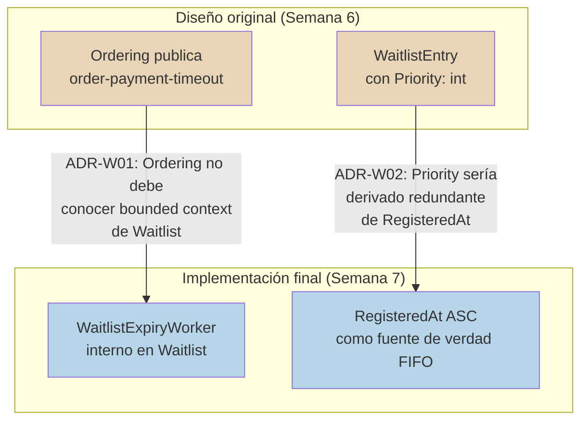
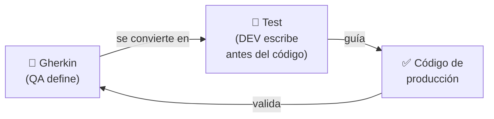
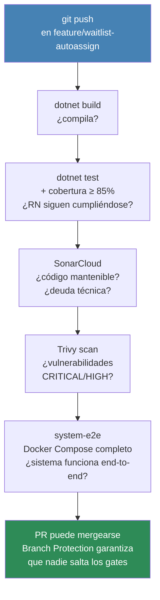
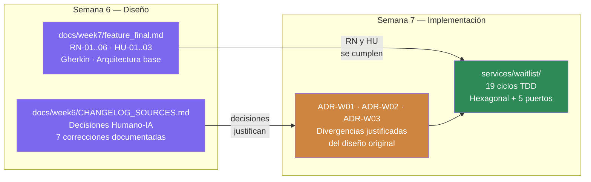

# Lista de Espera Inteligente
## Una lectura del SDLC completo: Negocio → QA → DEV

> **Propósito:** Conectar cada fase del ciclo de desarrollo con el problema de negocio que la originó
> **Audiencia:** Tech Lead, Evaluador técnico

---

## El hilo conductor

Un ingeniero full-cycle no es alguien que sabe hacer muchas cosas por separado. Es alguien que entiende cómo cada fase alimenta a la siguiente y puede tomar decisiones en cualquier punto del ciclo con visión del todo.



---

## 🏢 El problema de negocio

Cuando una reserva de asiento expira en una plataforma de ticketing, el asiento queda libre. Sin un mecanismo de equidad, ese momento se convierte en una carrera: el primero en recargar y hacer clic gana. No el que llegó primero. No el que más tiempo esperó. El más rápido.

> Este fenómeno tiene nombre: **F5 warfare**.

| Síntoma observable | Impacto en el negocio |
|-------------------|----------------------|
| Usuarios que intentaron comprar no pueden | Abandono de la plataforma |
| La demanda insatisfecha no se registra | Oportunidades de venta perdidas sin trazabilidad |
| Asientos que nadie termina de pagar | "Stock fantasma" que degrada la experiencia |

La solución no es técnica en su origen — es de equidad: **el que llegó primero debe ser atendido primero.**

---

## 📋 Fase 1 — Análisis

> *Artefactos documentados en [`docs/week7/feature_final.md`](../docs/week7/feature_final.md) como parte del diseño de Semana 6*

### Reglas de Negocio

El análisis tradujo el problema en invariantes que el sistema debe respetar en todo momento:

| ID | Regla | Raíz en el problema |
|----|-------|---------------------|
| **RN-01** | Un usuario tiene máximo una entrada activa por evento | Evitar acaparamiento en la cola |
| **RN-02** | No unirse si hay stock disponible | La lista aplica solo cuando el evento está agotado |
| **RN-03** | La cola es FIFO estricto | El orden de llegada define el orden de atención |
| **RN-04** | El usuario asignado tiene 30 minutos para pagar | Ventana razonable sin bloquear el asiento indefinidamente |
| **RN-05** | El asiento **no** se libera al inventario durante la rotación | Evitar que el asiento vuelva a la "carrera" mientras hay alguien en cola |
| **RN-06** | Si la cola está vacía, el asiento vuelve al inventario | Cuando no hay más interesados, el recurso debe liberarse |

### Historias de Usuario

```
HU-01 — Como usuario con evento agotado
        Quiero registrar mi correo en la lista de espera
        Para ser considerado si un asiento se libera

HU-02 — Como usuario en la cola
        Quiero que el sistema me asigne un asiento automáticamente
        Para asegurar mi lugar sin competir de nuevo

HU-03 — Como sistema
        Quiero detectar inacción y reasignar al siguiente en cola
        Para que ningún asiento quede sin convertirse en venta
```

### Criterios de Aceptación (Gherkin)

Aquí ocurre la primera transición crítica: las RN se convierten en **especificaciones ejecutables**. Gherkin no es solo documentación — si el criterio falla como test, el sistema no cumple la regla de negocio.

**RN-02** → criterio ejecutable:

```gherkin
Scenario: Intento de registro con asientos disponibles
  Given  que el evento tiene stock = 5
  When   el usuario intenta unirse a la lista de espera
  Then   el sistema responde 409 Conflict
  And    el mensaje indica "Hay tickets disponibles"
```

**RN-05** — la regla más crítica → criterio ejecutable:

```gherkin
Scenario: Rotación con siguiente en cola
  Given  que el usuario asignado no pagó en 30 minutos
  And    hay un segundo usuario en la cola
  When   el sistema detecta la expiración
  Then   el asiento pasa directamente al segundo usuario
  And    el asiento NO vuelve al inventario disponible en ningún momento
```

La palabra **"NO"** en el Gherkin no es retórica. Se convierte exactamente en:

```
_inventoryMock.Verify(ReleaseSeatAsync, Times.Never)
```

**Cobertura de criterios:**

| RN | Escenario Gherkin | Assertion derivado |
|----|--------------------|-------------------|
| RN-01 | ESC-03: "Ya estás en la lista" | `WaitlistConflictException` lanzada |
| RN-02 | ESC-02: "Hay tickets disponibles" | `WaitlistConflictException` con mensaje |
| RN-03 | ESC-04: primer usuario asignado | `ORDER BY RegisteredAt ASC` |
| RN-04 | ESC-04, ESC-05: ventana de 30 min | `ExpiresAt ≈ now + 30min` |
| RN-05 | ESC-05: "NO vuelve al inventario" | `Times.Never` en `ReleaseSeatAsync` |
| RN-06 | ESC-06: cola vacía libera asiento | `Times.Once` en `ReleaseSeatAsync` |

---

## 🧪 Fase 2 — Estrategia de Pruebas

> *Definida antes del diseño de la solución — las necesidades de testabilidad influyen directamente en las decisiones de arquitectura*

### La pirámide de pruebas

```
              ┌─────────────┐
              │    E2E      │  5%   Docker Compose completo
              │  (Sistema)  │       system-e2e-test.sh
              ├─────────────┤
              │ Integración │  15%  WebApplicationFactory
              │(Componente) │       In-Memory DB
              ├─────────────┤
              │   Unitarias │  80%  xUnit + Moq + FluentAssertions
              │  (Dominio + │       Infraestructura mockeada
              │ Aplicación) │
              └─────────────┘
```

**¿Por qué esta distribución?** La mayoría de las RN viven en el dominio y la aplicación. Las pruebas unitarias son las más baratas de escribir, mantener y ejecutar. Para que el 80% sea posible — sin base de datos ni red — el diseño necesita permitir inyectar mocks. Eso ya es una restricción de arquitectura.

### Los 7 Principios del Testing aplicados

| # | Principio | Aplicación concreta en esta feature |
|---|-----------|-------------------------------------|
| 1 | Las pruebas muestran presencia de defectos | Los 19 ciclos cubren los escenarios conocidos — no garantizan ausencia total de bugs |
| 2 | Pruebas exhaustivas son imposibles | Partición de equivalencia: si email vacío falla, no se prueban 1000 emails inválidos |
| 3 | **Shift-Left (pruebas tempranas)** | TDD: el test existe antes que el código — el bug tiene 0 segundos de vida |
| 4 | Agrupamiento de defectos | `WaitlistExpiryWorker` orquesta 4 servicios externos → mayor densidad de tests |
| 5 | Paradoja del pesticida | Casos edge agregados: idempotencia, payload v2 legacy, cola vacía, timeout de Catalog |
| 6 | Las pruebas dependen del contexto | En Waitlist: idempotencia y estados críticos. En Notification: no duplicar emails |
| 7 | Falacia de la ausencia de errores | Un sistema sin bugs que no cumple RN-05 es inútil — ATDD garantiza que los RN están cubiertos |

### Verificar vs. Validar

La distinción es técnica pero con impacto real en la completitud de los tests:

```csharp
// VALIDAR — la regla de negocio se cumplió
entry.Status.Should().Be(WaitlistEntry.StatusAssigned);
// ¿La entidad está en el estado correcto?

// VERIFICAR — el puerto fue invocado correctamente
_repoMock.Verify(r => r.UpdateAsync(entry, default), Times.Once);
// ¿El cambio fue persistido? Sin esto, el estado puede cambiar
// en memoria pero nunca guardarse — el test pasa pero el bug existe.
```

Un test completo necesita los dos. Solo validar puede dejar pasar bugs de persistencia. Solo verificar puede dejar pasar bugs de lógica de negocio.

### QA Gates — criterios no negociables antes de merge

| Gate | Criterio | Si falla |
|------|---------|----------|
| **Suite verde** | 0 tests en rojo | Pipeline bloquea el merge |
| **Cobertura** | ≥ 85% en Domain + Application | SonarCloud: Quality Gate failed |
| **Vulnerabilidades** | Trivy: 0 CRITICAL/HIGH | Pipeline falla con exit 1 |
| **Arquitectura** | NetArchTest: Domain sin dependencias externas | CI falla |
| **Build** | Sin errores ni warnings tratados como error | Branch Protection bloquea |

---

## 🏛️ Fase 3 — Diseño

> *La estrategia de pruebas definida en la fase anterior **dictó** las decisiones de arquitectura — no al revés*

### Por qué arquitectura hexagonal

La decisión no fue estética. Fue una consecuencia directa de la estrategia de pruebas: necesitaba que los handlers fueran testeables sin infraestructura real.

```
              ┌──────────────────────────────┐
              │      LÓGICA DE NEGOCIO       │
              │   WaitlistEntry (dominio)    │
              │   JoinWaitlistHandler        │
              │   AssignNextHandler          │
              │   WaitlistExpiryWorker       │
              └──────────┬───────────────────┘
                         │ habla con interfaces (puertos)
              ┌──────────▼───────────────────┐
              │   PUERTOS — los contratos    │
              │   IWaitlistRepository        │
              │   ICatalogClient             │
              │   IOrderingClient            │
              │   IInventoryClient           │
              │   IEmailService              │
              └──────────┬───────────────────┘
                         │ implementados por
              ┌──────────▼───────────────────┐
              │   INFRAESTRUCTURA            │
              │   PostgreSQL · Kafka · HTTP  │
              └──────────────────────────────┘
```

En producción: la infraestructura real implementa los puertos.
En los tests: un mock los implementa.
El handler no sabe la diferencia — y eso hace el TDD viable.

```csharp
// Con puertos, testear JoinWaitlistHandler no requiere
// una base de datos real ni un Catalog Service corriendo:
_catalogMock.Setup(c => c.GetAvailableCountAsync(eventId)).ReturnsAsync(0);
```

### La máquina de estados del dominio



Un handler no puede llamar `Assign()` sobre una entrada ya `assigned` — la entidad lanza `InvalidOperationException`. Los invariantes los protege el dominio, no la infraestructura.

### ADRs — Decisiones de diseño con consecuencias medibles

> *El diseño original en [`docs/week7/feature_final.md`](../docs/week7/feature_final.md) propuso `order-payment-timeout` como evento Kafka y un campo `Priority: int`. Ambas decisiones fueron reemplazadas durante la implementación — los motivos están documentados en los ADRs y en [`docs/week6/CHANGELOG_SOURCES.md`](../docs/week6/CHANGELOG_SOURCES.md).*



**ADR-W01 — Worker interno vs. evento externo**

Si Ordering publicara `order-payment-timeout`, cualquier fallo en Ordering dejaría asientos bloqueados indefinidamente. La rotación es un invariante del bounded context de Waitlist — debe vivir ahí.

*Consecuencia:* Ordering no tiene ninguna referencia al concepto de lista de espera. El bounded context está limpio.

**ADR-W02 — RegisteredAt como clave FIFO**

`Priority: int` sería un dato derivado de `RegisteredAt` — redundante y propenso a inconsistencias. `ORDER BY RegisteredAt ASC` es la única fuente de verdad.

*Consecuencia:* No hay lógica de mantenimiento de números de prioridad. RN-03 se cumple con una cláusula SQL, no con lógica adicional.

**ADR-W03 — ExpiresAt persistido con índice filtrado**

```sql
CREATE INDEX idx_waitlist_expiry
  ON waitlist_entries (expires_at)
  WHERE status = 'assigned';
```

El índice cubre solo las filas relevantes. En producción con 100k entradas, solo una fracción pequeña está `assigned` en cualquier momento — la consulta del worker es eficiente por diseño.

---

## 💻 Fase 4 — Implementación

### ATDD como metodología de desarrollo



No al revés. El test existe antes que el código.

### Los 19 ciclos TDD

```
Ciclos  1-6  │ WaitlistEntry (dominio)
             │ El dominio no tiene dependencias externas — se implementa
             │ y prueba completamente antes de tocar cualquier otra capa
             │
Ciclos  7-11 │ JoinWaitlistHandler
             │ Cada guard clause tiene su propio ciclo:
             │ stock disponible → 409 | duplicado → 409 | Catalog caído → 503
             │
Ciclos 12-16 │ AssignNextHandler + CompleteAssignmentHandler
             │ Idempotencia probada explícitamente en ciclos dedicados
             │
Ciclos 17-19 │ WaitlistExpiryWorker
             │ El ciclo más crítico: tres assertions para RN-05
```

**Ciclo 17 — el más importante:**

```csharp
// STATUS: 🔴 RED — WaitlistExpiryWorker no existe todavía
[Fact]
public async Task ProcessExpired_NextExists_RotatesWithoutReleasingInventory()
{
    // arrange: entrada expirada + siguiente en cola
    await worker.ProcessExpiredEntriesAsync(CancellationToken.None);

    // 1. VALIDAR: la regla de dominio se cumplió
    next.Status.Should().Be(WaitlistEntry.StatusAssigned);

    // 2. VERIFICAR: el cambio fue persistido
    _repoMock.Verify(r => r.UpdateAsync(next, default), Times.Once);

    // 3. VERIFICAR RN-05: el asiento NUNCA pasó por inventario
    _inventoryMock.Verify(i => i.ReleaseSeatAsync(It.IsAny<Guid>()), Times.Never);
}
```

El tercer assertion — `Times.Never` — es el que protege la RN más importante. Sin él, el test pasaría aunque el código liberara el asiento al inventario. El test negativo es tan importante como el positivo.

### Simbiosis Humano-IA

> *7 decisiones documentadas en [`docs/week6/CHANGELOG_SOURCES.md`](../docs/week6/CHANGELOG_SOURCES.md) donde el criterio de ingeniería corrigió o reemplazó la sugerencia de la IA*

| Sugerencia de la IA | Decisión humana | Razón |
|--------------------|----------------|-------|
| Trigger: Kafka `order-payment-timeout` desde Ordering | Worker interno en Waitlist | La rotación es un invariante de Waitlist — Ordering no debe conocer ese concepto |
| Campo `Priority: int` en `WaitlistEntry` | Eliminar — usar `RegisteredAt ASC` | `Priority` sería derivado redundante, fuente de bugs de sincronización |
| Redis como storage de la cola | PostgreSQL con índices | Consistencia transaccional con el resto del bounded context |
| Triggers de DB para la asignación | Eventos Kafka | Observabilidad, trazabilidad y desacoplamiento entre servicios |
| No usar Gherkin (demasiado formal) | Mantener Gherkin | Es especificación ejecutable — conecta negocio con tests |

**El criterio de corrección:** No "la IA se equivocó técnicamente" — sino "esta decisión tiene consecuencias en el bounded context / en los tests / en la mantenibilidad que la IA no consideró por no tener el contexto completo del sistema". Esa es la diferencia entre un ingeniero que usa IA y uno que delega a la IA.

---

## 🚀 Fase 5 — CI/CD

### El pipeline como SDLC automatizado

Cada commit en la rama de la feature activa una versión comprimida del ciclo completo:



### Shift-Left visualizado

```
Detectado en TDD        ████ Costo: mínimo — el bug no puede existir
Detectado en pipeline   ███░ Costo: bajo — primer commit
Detectado en review     ██░░ Costo: medio
Detectado en staging    █░░░ Costo: alto
Detectado en producción ░░░░ Costo: máximo
```

TDD es shift-left máximo: el test falla antes de que el código que causa el bug exista.

### Las RN están protegidas hasta producción

Cuando el código llega a `main`, se puede garantizar que:
- Las 6 reglas de negocio tienen tests que las verifican
- Esos tests corrieron en el pipeline antes del merge
- Si un cambio futuro viola una RN, el pipeline lo detecta antes de producción

**Las reglas de negocio no son documentos — son tests que corren en cada commit.**

---

## 🔗 La cadena de trazabilidad completa

### De Semana 6 a Semana 7



### De RN a código — línea a línea

| Regla de Negocio | Historia | Gherkin | Decisión de Diseño | Test que la protege |
|-----------------|----------|---------|--------------------|---------------------|
| RN-01 Una entrada activa | HU-01 | ESC-03 | `HasActiveEntryAsync` | `Handle_DuplicateActiveEntry_ThrowsConflict` |
| RN-02 No unirse con stock | HU-01 | ESC-02 | `ICatalogClient` puerto | `Handle_StockAvailable_ThrowsConflict` |
| RN-03 Cola FIFO | HU-02 | ESC-04 | `RegisteredAt ASC` + ADR-W02 | `Handle_PendingEntryExists_AssignsFirst` |
| RN-04 Ventana 30 min | HU-02/03 | ESC-04/05 | `WaitlistEntry.Assign()` calcula `ExpiresAt` | `Assign_SetsExpiresAt30MinutesAhead` |
| RN-05 No liberar en rotación | HU-03 | ESC-05 | `WaitlistExpiryWorker` + ADR-W01 | `Times.Never` en `ReleaseSeatAsync` |
| RN-06 Liberar si cola vacía | HU-03 | ESC-06 | `IInventoryClient.ReleaseSeatAsync` | `ProcessExpired_EmptyQueue_ReleasesToInventory` |

**Cobertura: 6 de 6 reglas de negocio tienen test, Gherkin y decisión de diseño trazable.**

---

## La narrativa en una frase

> El negocio identificó que la recuperación de asientos era injusta → el análisis tradujo esa injusticia en 6 reglas verificables → QA definió la estrategia antes del código → el diseño hexagonal fue una consecuencia de esa estrategia → DEV construyó ciclo a ciclo guiado por los criterios → el pipeline garantiza que ningún cambio futuro rompa las reglas de negocio.

Eso es un SDLC completo aplicado a una feature real.

---

*Documentación de referencia detallada: [`waitlist-feature/`](./) · Diseño original: [`docs/week7/feature_final.md`](../docs/week7/feature_final.md) · Decisiones Humano-IA: [`docs/week6/CHANGELOG_SOURCES.md`](../docs/week6/CHANGELOG_SOURCES.md)*
